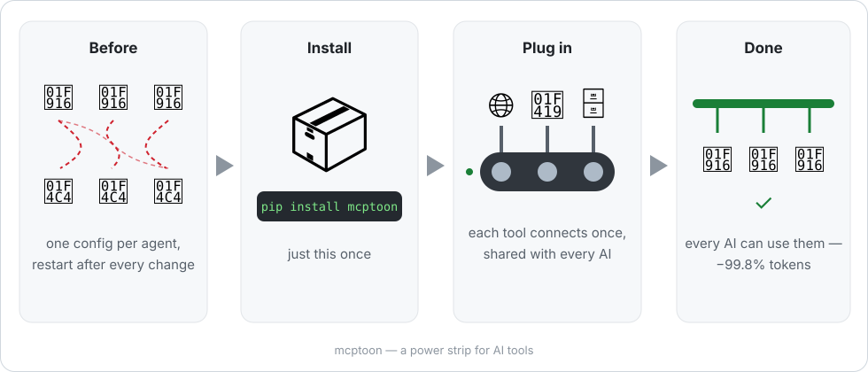

<div align="center" markdown="1">

# mcptoon

**Install once — and every AI on your computer can use all of your AI tools.**

**Real cross-agent MCP management: one config for every agent, `--watch` keeps them aligned.**

It works like a power strip for AI tools: plug each tool in once, and Claude Code,
Cursor, Codex — or any program that runs commands — can use them all. No config files,
no plugins, no restarts. As a bonus, when an AI reads the tool list, it pays
**99.8% fewer tokens** than with raw JSON.

Technical version: mcptoon is a zero-dependency CLI that connects any agent to every
Model Context Protocol server — whether or not the agent supports MCP.

[](https://pypi.org/project/mcptoon/)
[](https://pypi.org/project/mcptoon/)
[](https://github.com/activeing123/mcptoon/actions/workflows/ci.yml)
[](#for-developers)
[](#honest-limitations)
[](LICENSE)

[English](README.md) · [中文文档](README.zh-CN.md) · [Changelog](CHANGELOG.md) · [Report an issue](https://github.com/activeing123/mcptoon/issues)

<p align="center"></p>

</div>

## The part nobody else has: agents need zero setup

Native MCP means editing a JSON file for every agent, in every format, and restarting.
Proxy tools mean running a service and pointing each agent at it.

mcptoon needs neither. It is a program your agent already knows how to run:

```text
You:    "What tools do we have? Then fetch https://example.com and summarize."
Agent:  $ mcptoon manifest --compact        ← gets a name index, not schemas
Agent:  $ mcptoon call fetch fetch '{"url":"https://example.com"}'
```

No `mcpServers` entry. No plugin API. Nothing to register, nothing to restart. Want it
automatic? One line in your agent's instruction file (CLAUDE.md / AGENTS.md / system
prompt) is enough — that is prompting, not configuration.

This is also why mcptoon reaches where MCP cannot: shell scripts, CI pipelines, cron
jobs, aider, terminal-only environments — anything that can execute a command.

## Why mcptoon exists



If you run more than one AI coding agent, you have both of these problems today:

**1. Every agent keeps its own MCP config, in its own file, in its own format.**

| Agent | Config file |
|-------|-------------|
| Claude Desktop | `claude_desktop_config.json` |
| Claude Code | `.claude.json` |
| Cursor | `.cursor/mcp.json` |
| Cline / Windsurf / VS Code Copilot | various JSON, various shapes |

Add a server in Cursor, forget Claude. Fix a path in Claude, break Cursor. Repeat weekly.

**2. Tool discovery burns your context window before any work starts.**
A listing of 255 tools costs **71,929 tokens** as raw JSON schemas (measured with
tiktoken `cl100k_base`). On a 128K context, that is more than half the window spent
on syntax — before the model has answered anything.

mcptoon fixes both with one file and one binary.

## Try it in 60 seconds

```bash
pip install mcptoon        # pure stdlib, ~250KB, no deps

mcptoon quickstart         # finds servers you already configured, lists their tools
mcptoon demo               # live side-by-side: JSON vs mcptoon, real token counts
```

`quickstart` detects existing configs, imports them, and shows what you have.
`demo` spins up a sample fetch server and prints the before/after numbers on your machine —
no trust required, measure it yourself.

Runs on **Windows, macOS and Linux**. Being pure Python makes Windows a first-class
citizen — no node-gyp builds, no POSIX-only scripts.

## The three moves

### 1 · Configure once — `sync`

```bash
mcptoon add fetch --stdio npx -y @modelcontextprotocol/server-fetch
mcptoon sync               # writes native config to every detected agent
```

mcptoon merges instead of overwriting — servers you configured manually stay put.
One command gives you **cross-agent tool management**: a single source of truth for
MCP servers across every agent on the machine, no copy-pasting JSON between Cursor,
Claude and friends.

```bash
mcptoon sync --watch         # keep every agent aligned automatically
mcptoon sync --dry           # preview the writes
mcptoon sync --agent cursor  # target one agent
```

`--watch` polls your config files and re-syncs on any change — MCP config sync
across agents, continuously. Drift detection catches external edits; merge mode
preserves manually-added servers.

### 2 · Pay for names, not schemas — `manifest`

Your agent asks "what tools exist?" mcptoon answers with a name index.
Schemas stay on disk in `~/.mcptoon/config.json` and never enter the context.

```bash
$ mcptoon manifest --compact
fetch: fetch(url) · github: search_repos(q), get_file(repo, path) · sqlite: query(sql) · ...
```

| Tool listing (tiktoken cl100k_base) | tokens | vs raw JSON |
|-------------------------------------|-------:|------------:|
| Raw JSON schemas, 255 tools         | 71,929 | — |
| `--slim` (names + parameter types)  |  8,282 | −88.5% |
| `--compact` (names only)            |    123 | **−99.8%** |

<sub>Measured with tiktoken cl100k_base over a real-world 255-tool config (50 MCP servers).
Your mix will differ. Reproduce: `mcptoon manifest --compact --tokens`.</sub>

In human terms: 71,929 tokens is roughly a 300-page book. 123 tokens is a sticky note.

Choosing between approaches? [docs/comparison.md](docs/comparison.md) breaks down
setup cost, token cost and safety, category by category.

It is a dial, not a switch: `--json` is always available when you want zero ambiguity,
and `call` results default to plain text, security-checked.

### 3 · One door in front of every server — `serve`

Point your agent at a single entry instead of N servers:

```json
"mcptoon": { "command": "mcptoon", "args": ["serve"] }
```

```bash
mcptoon serve                  # stdio — one agent
mcptoon serve --listen :8080   # HTTP — multiple agents, remote machines
```

Parallel manifest loading (20 workers, 100 servers ≈ 5s), a 5-minute schema cache,
and a 30s timeout per call so one hung server cannot stall your session.

## Everything else in the box

| Command | What it does |
|---------|--------------|
| `mcptoon sync --watch` | Poll configs, re-sync MCP servers across agents continuously |
| `mcptoon call <server> <tool> '{…}'` | Call any tool on any server |
| `mcptoon call --auto <tool> '{…}'` | Route by tool name, server found for you |
| `mcptoon health` | Which servers are alive, dead, and how fast — exits 1 in CI if anything is dead |
| `mcptoon install <name> --npm <pkg>` | Install a server, auto-discover tools |
| `mcptoon search <query>` | Fuzzy search across every tool you have |
| `mcptoon doctor` | Self-diagnose Python, config, connectivity |

**Why `health` matters:** a 2026 community audit found [52% of published MCP servers unreachable](https://www.163.com/dy/article/KSSN2L5E05561FZP.html).
Configured ≠ alive.

```
── mcptoon health: 3/5 alive ──────────────
  ✓ fetch     [stdio]  1 tool     120ms  ok
  ✗ brave     [stdio]  0 tools  10002ms  timeout → Timed out after 10s
  ✓ github    [http]  12 tools    340ms  ok
```

**Under the hood**

- **Errors that agents can act on** — every failure returns a structured envelope with a
  fix suggestion ("server `fetchh` not found — did you mean `fetch`?"), so your agent
  self-corrects instead of stalling until you rescue it.
- **Continuous sync (`--watch`)** — polls config files and re-syncs MCP servers across
  agents on any change. Drift detection with merge/strict modes.
- **Cross-server fuzzy search** — `mcptoon search star` finds the right tool across
  every configured server, with relevance scoring.
- **`call --auto`** — give just the tool name; mcptoon finds the server that provides it.
- **Shell completions** — bash, zsh, fish and PowerShell.
- **JSON or TOML config** — whichever reads better for you, both live in `~/.mcptoon/`.
- **Local usage log** — see which tools you called and when. The record never leaves
  your machine.

## Security, applied to every call

Supply-chain safety comes free with zero dependencies: no npm subtree, no postinstall
scripts, nothing to audit but ~6,800 lines of readable Python.

MCP servers run code on your machine and return arbitrary text into your agent's context.
mcptoon inspects every result before it gets there:

| Check | Blocks |
|-------|--------|
| Prompt injection | `"ignore previous instructions"` buried in tool output |
| Credential leak | `sk-…`, `AKIA…`, `ghp_…` patterns in tool output |
| Dangerous operations | `delete` / `drop` / `purge` tool names unless you pass `--destructive` |

No telemetry. No analytics. No phone-home. API keys pass through from your config or
environment and are never stored by mcptoon.

## Works with

**Claude Desktop · Claude Code · Cursor · Cline · Windsurf · VS Code Copilot · Codex · Gemini CLI · OpenCode** — plus aider, shell scripts, CI jobs and anything else that executes commands, including environments with no MCP support at all. That is what being a CLI first means.

<details markdown="1">
<summary><strong>How is this different from raw configs or tool-search proxies?</strong></summary>

| | Per-agent configs | Tool-search proxies | mcptoon |
|---|---|---|---|
| Agent-side setup | edit JSON per agent + restart | run a service, point agents at it | **none — it is just a command** |
| Files to maintain | one per agent | one per agent | **one, synced everywhere** |
| Discovery cost | full schemas | search first, load on demand | **name index, schemas never leave disk** |
| Dead-server detection | — | varies | built-in, CI-friendly exit codes |
| Output inspection | — | varies | injection + leak checks on every call |
| To adopt | native support | run a service | `pip install mcptoon` |

They also compose: `serve` mode gives you the proxy shape when you want it.

</details>

<details markdown="1">
<summary><strong>Honest limitations</strong></summary>

#### Honest limitations

- `--compact` lists tool **names only** — no descriptions or parameter details. When the
  model needs signatures, use `--slim`. When it needs everything, use `--json`.
- Token counts above were measured with tiktoken `cl100k_base`. Other tokenizers differ
  (typically ±10–25% on these payloads). The main saving — schemas not entering context
  at all — is tokenizer-independent.
- Each stdio call spawns a process (~300 ms cold). Hot paths should use `serve` mode;
  the schema cache absorbs repeated listings for 5 minutes.
- Terminal-first. There is no GUI.

</details>

<details markdown="1">
<summary><strong>FAQ</strong></summary>

#### FAQ

**Isn't this just compression?**
No. Compression ships the full payload into context and unpacks it later — the cost
still lands in the window eventually. mcptoon keeps schemas on disk; they never enter
the context at all. What the agent sees is a short index of names.

**Claude Code already defers MCP tool loading — isn't this redundant?**
Deferred loading decides *when* definitions load. mcptoon decides how much a listing
*costs*, in every agent at once, and adds sync, health, and security on top. They solve
different layers and stack fine together.

**Why a CLI instead of a library or proxy?**
Because the shell is the one interface every agent already speaks. No plugin API, no
SDK, no per-agent config file, no service to keep alive — and agents that don't support
MCP at all can still drive every MCP server through it. Prefer long-lived connections?
`mcptoon serve` is the same tool in proxy form, stdio or HTTP.

**Are the savings from tricks like replacing `null` with symbols?**
No — that misconception comes from earlier TOON-style experiments. The headline number
comes from architecture: full schemas simply aren't sent. Optional `--toon` encoding of
tool *results* saves a further ~30–40%, and it is off by default.

</details>

## For developers

```python
from mcptoon.client import MCPClient

with MCPClient(stdio=["npx", "-y", "@modelcontextprotocol/server-fetch"]) as c:
    tools = c.list_tools()
    result = c.call_tool("fetch", {"url": "https://example.com"})
```

```bash
git clone https://github.com/activeing123/mcptoon.git && cd mcptoon
pip install -e . --no-build-isolation && pip install pytest
python -m pytest tests/ -v          # 531 tests, green expected
docker run --rm -v ~/.mcptoon:/root/.mcptoon mcptoon manifest --compact
```

Zero third-party imports is a hard rule enforced in review. New features need tests.
~6,800 lines of Python across 14 modules — see [CONTRIBUTING.md](CONTRIBUTING.md).

## License

Apache 2.0 — see [LICENSE](LICENSE) and [NOTICE](NOTICE).

<div align="center" markdown="1">

*Independent third-party client for the Model Context Protocol. Not affiliated with Anthropic, Cursor, or Microsoft.*

If mcptoon saved you tokens today, a ⭐ helps other people find it.

</div>
