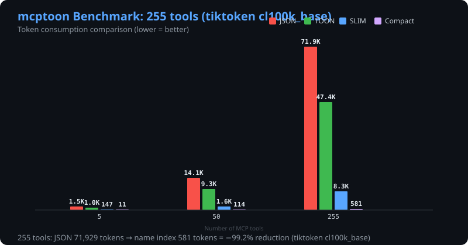

<div align="center">

# mcptoon

**本地添加 1,000 个 MCP 工具，也不用担心 token 上下文。**

mcptoon 是一个 CLI 工具，站在你的 AI Agent 和 MCP 服务器之间。加多少服务器都行——Agent 的上下文窗口始终保持干净。Schema 永远不进上下文，只有你要的紧凑结果会进去，而且比 JSON 小 30-97%。

**工具是你自己的。** mcptoon 不搄带任何服务器——只是一个 200KB 的 CLI。你按需从 npm/pip/HTTP 添加想要的服务器，一条命令加一个。删掉 mcptoon？你的 MCP 服务器照常独立运行。

[](https://pypi.org/project/mcptoon/)
[](https://pypi.org/project/mcptoon/)
[](LICENSE)
[](#隐私)
[](#贡献)

**👉 `pip install mcptoon`** · [English](README.md) · [中文文档](README.zh-CN.md) · [反馈问题](https://github.com/activeing123/mcptoon/issues)



</div>

---

## 30 秒上手

```bash
pip install mcptoon                          # 零依赖，200KB

# 添加任意 MCP 服务器——一条命令：
mcptoon add fetch --stdio npx -y @modelcontextprotocol/server-fetch

# 查看所有可用工具（255 个工具只需 117 token）：
mcptoon manifest --compact

# 调用工具——输出比 JSON 小 30-97%：
mcptoon call fetch fetch '{"url":"https://example.com"}' --toon
```

**或者让 mcptoon 自动发现你机器上已有的服务器：**

```bash
mcptoon quickstart     # 自动发现 + 配置 + 展示工具——一条命令搞定
```

就这些。不用编辑 JSON 配置。不用调试 MCP 协议。不污染上下文窗口。

---

## 解决什么问题？

每个 MCP Agent（Claude Code、Cursor、Codex 等）都会在开始工作前把**所有工具的 schema 塞进你的上下文窗口**：

```
10 个 MCP 服务器 → 50,000-100,000+ token 的 JSON schema → 128K 上下文：40-80% 没了
100 个服务器 → 200,000+ token → 上下文窗口死了
```

于是你不用的时候卸载服务器，用的时候再加载。来回折腾。想加个新服务器还得手写 JSON 配置——少个逗号就全崩了。

**mcptoon 解决这个问题。** 你的 MCP 服务器都配着，但它们的 schema **永远不进 Agent 的上下文**。Agent 只跑 `mcptoon` 命令，只有你要的紧凑结果进上下文——TOON 编码让它比 JSON 小 30-97%。

```
不用 mcptoon：255 个工具 → 90,804 token 的 schema 占满上下文
用 mcptoon：  255 个工具 → 117 token。省了 99.87%。
```

---

## 安装 MCP 服务器——每条一个命令

```bash
# 从 npm 安装（大部分 MCP 服务器在这里）：
mcptoon install brave-search --npm @anthropic/mcp-server-brave-search

# 从 pip 安装：
mcptoon install my-tool --pip mcp-my-tool

# HTTP/SSE 服务器：
mcptoon install remote-api --url https://example.com/mcp

# 列出已安装：
mcptoon install --list

# 卸载：
mcptoon install --remove brave-search
```

mcptoon 自动连接、发现工具、生成 handler、注册。不需要重启。

**支持任何 MCP 服务器：**

```bash
mcptoon add my-server --stdio npx -y @any/mcp-package
mcptoon manifest --toon    # 直接就能用
```

---

## 所有 AI Agent 都能用

mcptoon 是 CLI 工具。**你的 Agent 能跑 shell 命令，就能用 mcptoon。** 不需要插件、SDK、每个 Agent 单独配。

| Agent | 怎么用 |
|---|---|
| **Claude Code** | 在 SKILL.md 里写 `mcptoon` 命令 |
| **Codex (OpenAI)** | 在 AGENTS.md 里加 `mcptoon` |
| **Cursor** | 在 .cursorrules 里加 `mcptoon` |
| **OpenCode** | 在自定义命令里用 `mcptoon` |
| **任何 Agent** | 能跑 shell 命令就能调 `mcptoon` |

在 `~/.mcptoon/config.json` 配置一次，所有 Agent 共享同样的服务器和工具。换 Agent？配置跟着你走。

```bash
export MCPTOON_AGENT_TYPE=claude   # 所有调用自动用 --toon
```

你的 AI 甚至可以自己加工具——不需要人介入：

```bash
# Agent 干活干到一半需要 GitHub 访问？它自己跑：
mcptoon add github --stdio npx -y @modelcontextprotocol/server-github
mcptoon call github search_repos '{"query":"mcp"}' --toon
# 完事。不用编辑 JSON。不用重启。上下文不丢。
```

---

## 数据

### Token 节省（255 个工具，5 种格式）

| 工具数 | JSON | TOON | SLIM | Compact |
|-------|------|------|------|---------|
| 5 | 1,897 | 981 (-48%) | 111 (-94%) | 16 (-99%) |
| 50 | 17,790 | 8,776 (-51%) | 1,203 (-93%) | 117 (-99%) |
| 255 | **90,804** | **44,863 (-51%)** | **6,174 (-93%)** | **117 (-100%)** |

- `--compact` → 工具名：**省 97-100%**
- `--slim` → 工具 schema 带参数：**省 93%**
- `--toon` → 结构化结果（可逆）：**省 30-60%**

复现：`python _benchmark.py` → 输出 `assets/benchmark_data.json`

### 对比实例

**不用 mcptoon**（所有 MCP 客户端返回的——287 token）：

```json
[{"name":"search_web","description":"Search the web for information",
"inputSchema":{"type":"object","properties":{"query":{"type":"string","description":"Search query"}}}}]
```

**用 mcptoon**（5 token）：

```
search_web
```

**用 mcptoon --slim**（14 token，包含参数信息）：

```
search_web|query:s*
```

---

## 安全

三层防护，全部内置：

| 层 | 做什么 | 示例 |
|-------|-------------|---------|
| **危险操作拦截** | 默认拦截 `delete`/`drop`/`purge` | `docker_remove` → 拦截，除非加 `--destructive` |
| **Prompt 注入防护** | 扫描结果中的注入模式 | `"ignore previous instructions"` → 拦截 |
| **凭据泄露检测** | 扫描结果中的暴露 key/token | `sk-abc...xyz` → 拦截，不进 Agent 上下文 |

- **没有遥测。** 没有分析、没有崩溃报告、没有回传。
- **不存凭证。** API key 从你的配置或环境变量直接传递。
- **没有依赖。** 纯 Python 标准库。没有供应链要审计。

---

## 全部命令

```bash
mcptoon quickstart              # 一键上手（发现 + 配置 + 展示工具）
mcptoon init --auto             # 自动发现机器上的 MCP 服务器
mcptoon add <name> --stdio npx -y <package>   # 添加任意 MCP 服务器
mcptoon install <name> --npm <package>        # 安装 + 自动生成 handler
mcptoon list                    # 查看已配置服务器
mcptoon manifest --compact      # 所有工具名（255 个工具只需 117 token）
mcptoon manifest --slim         # 工具 schema（比 JSON 小 93%）
mcptoon manifest --toon         # 标准 TOON 格式
mcptoon inspect <server> <tool> # 查看某个工具的 schema
mcptoon search <query>          # 跨服务器搜索工具
mcptoon call <server> <tool> '{"args":"here"}' --toon   # 调用工具
mcptoon call --auto <tool> '{"args":"here"}' --toon     # 自动找服务器
mcptoon doctor                  # 自检：Python、配置、连通性
mcptoon usage                   # 本地调用统计
mcptoon completion bash         # Shell 补全（bash/zsh/fish/ps）
```

### 输出格式

| Flag | 输出 | 节省 |
|---|---|---|
| `--compact` | 仅工具名 | 比 JSON **省 97-100%** |
| `--slim` | 工具 schema (`name\|param:type*`) | 比 JSON **省 93%** |
| `--toon` | 标准 TOON (toon-format/toon 规范) | 比 JSON **省 30-60%**，可逆 |
| `--json` | 标准 JSON | 基准线 |
| `--raw` | 原始响应 | 全量 |
| `--head N` | 仅前 N 条 | 可变 |
| `--max-chars N` | 截断到 N 字符 | 可变 |
| `--full` | 禁用默认 4000 字符截断 | 全量 |
| `--stdin` | 从 stdin 读参数（大 payload） | — |

---

## 原理

mcptoon 是 **CLI 工具**，不是 MCP 客户端库。你的 Agent 不连接 MCP 服务器——它跑 `mcptoon` 命令。Schema 存在磁盘上的 `~/.mcptoon/config.json` 里，不进上下文窗口。

**两层解耦：**

```
第 1 层: mcptoon CLI (~200KB, 零依赖)
         在 Agent 的 shell 里运行。schema 永远不进上下文。
                    │
第 2 层: 实际 MCP 服务器 (npm/pip 包)
         只有调用工具时才启动。不用就零开销。
```

- 1,000 个服务器配好 → 0 个在运行，直到你用其中一个
- mcptoon 不搄带任何服务器——你加你想要的，一条命令加一个
- 删掉 mcptoon？你的 MCP 服务器照常独立运行

---

## Python API

```python
from mcptoon.client import MCPClient
from mcptoon.output import toon_encode, toon_decode

with MCPClient(stdio=["npx", "-y", "@modelcontextprotocol/server-fetch"]) as c:
    tools = c.list_tools()
    print(toon_encode(tools))         # 紧凑 TOON 输出
    result = c.call_tool("fetch", {"url": "https://example.com"})
    print(toon_encode(result))        # 紧凑 TOON 输出
    decoded = toon_decode(toon_encode(result))
    assert decoded == result          # 可逆
```

---

## 架构

```
src/mcptoon/
├── cli.py        # CLI 入口 + 参数解析
├── client.py     # MCPClient — stdio + HTTP 传输
├── installer.py  # 一键 MCP 服务器安装 + 自动 handler 生成
├── router.py     # 工具路由 + 注入/凭据泄露检测
├── config.py     # 服务器配置 (JSON + TOML)
├── manifest.py   # 工具发现 + 跨服务器搜索
├── discover.py   # 零配置自动发现 (5 层)
├── output.py     # 标准 TOON + compact/slim 渲染
├── cache.py      # Schema 缓存 (5分钟 TTL)
├── usage.py      # 本地用量统计
└── errors.py     # 结构化错误 + 修复建议
```

约 4500 行。429 个测试。零第三方 import。约 200KB 源码。

## Docker

```bash
docker build -t mcptoon .
docker run --rm mcptoon help
docker run --rm -v ~/.mcptoon:/root/.mcptoon mcptoon manifest --toon
```

`manifest`、`list`、`inspect`、`doctor` 直接能用。`call` 和 `add --stdio` 需要镜像里有服务器运行时（如 `npx`）。

## 贡献

```bash
git clone https://github.com/activeing123/mcptoon.git
cd mcptoon
pip install -e . --no-build-isolation
pip install pytest pytest-cov
python -m pytest tests/ -v   # 429 个测试, 0.5s
```

零依赖是硬规则。新功能需要测试。见 [CONTRIBUTING.md](CONTRIBUTING.md)。

## 许可证

Apache 2.0。见 [LICENSE](LICENSE) 和 [NOTICE](NOTICE)。

---

<div align="center">

*mcptoon 是独立的第三方 MCP 客户端，不隶属于 Anthropic。*

**觉得有用？点个 star 帮更多人发现它。**

</div>
