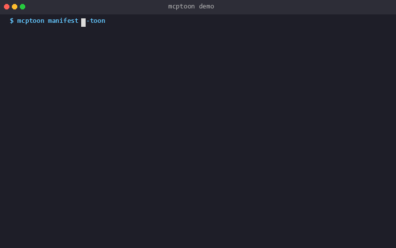
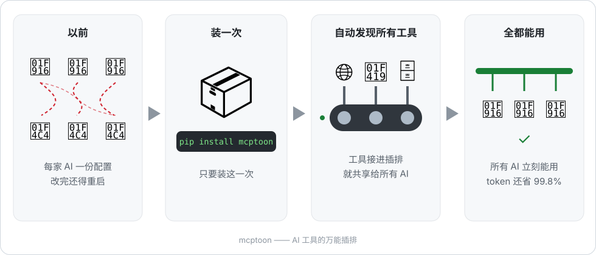

<div align="center" markdown="1">

# mcptoon

**装一次，你电脑上的每个 AI 就能用你所有的 AI 工具。**

它像一根给 AI 工具用的万能插排：工具插一次，Claude Code、Cursor、Codex，
乃至任何能执行命令的程序，全都能用。不改配置文件、不装插件、不用重启。
附带的好处：AI 读一遍工具清单的开销，比原始 JSON **省 99.8%**。

技术版一句话：一个零依赖的命令行工具，把任何 Agent 接到所有 MCP 服务器上——
对方支不支持 MCP 都行。

[](https://pypi.org/project/mcptoon/)
[](https://pypi.org/project/mcptoon/)
[](https://github.com/activeing123/mcptoon/actions/workflows/ci.yml)
[](#开发者指南)
[](#坦诚的局限)
[](LICENSE)

[English](README.md) · [中文文档](README.zh-CN.md) · [更新日志](CHANGELOG.md) · [提 Issue](https://github.com/activeing123/mcptoon/issues)

<p align="center"></p>

</div>

## 别家没有的部分：Agent 侧零配置

原生 MCP 意味着给每个 Agent 各改一份 JSON、各按各的格式、改完还得重启。
代理方案意味着常驻一个服务，再把每个 Agent 逐个指过去。

mcptoon 两样都不要。它就是一个你的 Agent 本来就会运行的程序：

```text
你：    "我们有哪些工具？然后抓取 https://example.com 总结一下。"
Agent： $ mcptoon manifest --compact     ← 拿到名字索引，不是 schema
Agent： $ mcptoon call fetch fetch '{"url":"https://example.com"}'
```

不写 `mcpServers` 条目。不接插件 API。没有注册，没有重启。想让它自动用？
在 Agent 的指令文件（CLAUDE.md / AGENTS.md / 系统提示）里加一行就够——
那叫提示词工程，不叫配置。

这也是 mcptoon 能渗透到 MCP 到不了的地方的原因：shell 脚本、CI 流水线、
cron 任务、aider、纯终端环境——一切能执行命令的地方。

## 为什么需要 mcptoon



只要你同时用两个以上的 AI 编程 Agent，下面两件事你今天就在经历：

**1. 每个 Agent 一套 MCP 配置，各存各家，格式各异。**

| Agent | 配置文件 |
|-------|---------|
| Claude Desktop | `claude_desktop_config.json` |
| Claude Code | `.claude.json` |
| Cursor | `.cursor/mcp.json` |
| Cline / Windsurf / VS Code Copilot | 各不相同的 JSON |

在 Cursor 加了新服务器，Claude 忘了加；在 Claude 修好了路径，Cursor 又坏了。周而复始。

**2. 工具发现在干活之前先烧掉半个上下文窗口。**
255 个工具的完整 JSON schema 清单要吃 **71,929 个 token**（tiktoken `cl100k_base` 实测）。
128K 的窗口，一半以上花在语法上——模型还没开始回答任何问题。

mcptoon 用一个文件、一个二进制，同时解决这两个问题。

## 60 秒上手

```bash
pip install mcptoon        # 纯标准库，约 250KB，零依赖

mcptoon quickstart         # 自动发现你已配置的服务器，列出全部工具
mcptoon demo               # 现场对比：JSON vs mcptoon，真实 token 数字
```

`quickstart` 会检测已有配置并导入；`demo` 起一个示例 fetch 服务器，
在你自己的机器上打出前后对比数字——不用信我们，自己量。

**Windows / macOS / Linux** 全平台支持。纯 Python 意味着 Windows 在这是一等公民：
没有 node-gyp 编译，没有只认 POSIX 的脚本。

## 三步走

### 第 1 步 · 配一次就够 —— `sync`

```bash
mcptoon add fetch --stdio npx -y @modelcontextprotocol/server-fetch
mcptoon sync               # 把配置写进每一个检测到的 Agent
```

sync 是合并不是覆盖——你手动配好的服务器原样保留。
一条命令就是**跨 Agent 工具管理**：MCP 服务器的一份配置作为唯一事实来源，
机器上所有 Agent 共享，不用再在 Cursor、Claude 之间来回复制粘贴 JSON。

```bash
mcptoon sync --dry           # 预览会写什么，不动真格
mcptoon sync --agent cursor  # 只同步 Cursor
```

### 第 2 步 · 只为名字付钱，不为 schema 付钱 —— `manifest`

Agent 问"有哪些工具？"，mcptoon 回一个名字索引。
schema 留在磁盘上的 `~/.mcptoon/config.json` 里，根本不进上下文。

```bash
$ mcptoon manifest --compact
fetch: fetch(url) · github: search_repos(q), get_file(repo, path) · sqlite: query(sql) · ...
```

| 工具清单开销（tiktoken cl100k_base） | tokens | 对比原始 JSON |
|--------------------------------------|-------:|--------------:|
| 完整 JSON schema，255 个工具          | 71,929 | — |
| `--slim`（名字 + 参数类型）           |  8,282 | −88.5% |
| `--compact`（仅名字）                 |    123 | **−99.8%** |

说人话就是：71,929 个 token 大约是一本三百页的书；123 个，是一张便利贴。

在几种方案之间纠结？[docs/comparison.md](docs/comparison.md) 按类目逐项对比了
配置成本、token 成本和安全能力。

这是一个旋钮，不是开关：想要零歧义随时切回 `--json`；
`call` 的返回结果默认纯文本输出，且经过安全检查。

### 第 3 步 · 所有服务器只开一扇门 —— `serve`

与其让 Agent 直连 N 个服务器，不如指给它一个入口：

```json
"mcptoon": { "command": "mcptoon", "args": ["serve"] }
```

```bash
mcptoon serve                  # stdio 模式 —— 单 Agent
mcptoon serve --listen :8080   # HTTP 模式 —— 多 Agent / 远程机器
```

并行加载 manifest（20 并发，100 台服务器约 5 秒）、5 分钟 schema 缓存、
单次调用 30 秒超时——一台服务器卡死不会拖垮你的会话。

## 还有这些

| 命令 | 干什么 |
|------|--------|
| `mcptoon call <server> <tool> '{…}'` | 调任意服务器的任意工具 |
| `mcptoon call --auto <tool> '{…}'` | 只给工具名，自动找到对应服务器 |
| `mcptoon health` | 哪些服务器活着、死了、多快——CI 里全死光退出码为 1 |
| `mcptoon install <name> --npm <pkg>` | 一条命令装服务器并自动发现工具 |
| `mcptoon search <query>` | 模糊搜索你手头所有工具 |
| `mcptoon doctor` | 自检 Python、配置、连通性 |

**为什么 `health` 重要：** 2026 年社区审计发现[52% 的公开 MCP 服务器根本连不上](https://www.163.com/dy/article/KSSN2L5E05561FZP.html)。
配置里写了 ≠ 它活着。

```
── mcptoon health: 3/5 alive ──────────────
  ✓ fetch     [stdio]  1 tool     120ms  ok
  ✗ brave     [stdio]  0 tools  10002ms  timeout → Timed out after 10s
  ✓ github    [http]  12 tools    340ms  ok
```

**藏在引擎盖下**

- **Agent 能自己消化的报错** —— 每个失败都返回结构化错误信封并附修复建议
  （"找不到服务器 `fetchh` —— 你是不是想要 `fetch`？"），Agent 读一遍就能自我纠正，
  不用卡在那等你救场。
- **跨服务器模糊搜索** —— `mcptoon search star` 带相关性评分，在所有已配置的
  服务器里找出对的那个工具，人和 Agent 都用得上。
- **`call --auto`** —— 只给工具名，mcptoon 自动找到提供它的服务器。
- **四家 shell 补全** —— bash、zsh、fish、PowerShell。
- **JSON 或 TOML 配置** —— 哪个顺眼用哪个，都在 `~/.mcptoon/` 里。
- **本地用量记录** —— 调用过哪些工具、什么时候调的。记录只留在本机，绝无遥测。

## 安全检查，每一次调用都过

供应链安全是零依赖白送的：没有 npm 子树、没有 postinstall 安装脚本，
需要审计的只有约 6,800 行读得懂的 Python。

MCP 服务器在你机器上跑代码，还会把任意文本塞进 Agent 的上下文。
mcptoon 在结果进入上下文之前逐条检查：

| 检查项 | 拦截内容 |
|--------|---------|
| 提示词注入 | 工具输出里埋的 `"ignore previous instructions"` |
| 凭据泄漏 | 输出中的 `sk-…`、`AKIA…`、`ghp_…` 等密钥特征 |
| 危险操作 | 名带 `delete` / `drop` / `purge` 的工具，除非显式加 `--destructive` |

无遥测。无统计上报。无外呼。API Key 只从你的配置或环境变量透传，mcptoon 不存储。

## 兼容范围

**Claude Desktop · Claude Code · Cursor · Cline · Windsurf · VS Code Copilot · Codex · Gemini CLI · OpenCode**
——外加 aider、shell 脚本、CI 任务和一切能执行命令的东西，包括完全不支持 MCP 的环境。
这就是"CLI 优先"的含义。

<details markdown="1">
<summary><strong>和裸写配置、工具搜索型代理有什么区别？</strong></summary>

| | 各 Agent 单独配置 | 工具搜索型代理 | mcptoon |
|---|---|---|---|
| Agent 侧接入 | 每 Agent 改 JSON + 重启 | 常驻服务再逐个指过去 | **无 —— 它就是一条命令** |
| 要维护的配置文件 | 每 Agent 一份 | 每 Agent 一份 | **一份，处处同步** |
| 发现成本 | 全量 schema | 先搜索后按需加载 | **名字索引，schema 根本不出磁盘** |
| 死服务器检测 | 无 | 看实现 | 内置，CI 友好退出码 |
| 输出检查 | 无 | 看实现 | 每次调用过注入 + 泄漏检测 |
| 接入方式 | 原生支持 | 要跑常驻服务 | `pip install mcptoon` |

它们也能组合：想要代理形态时，`serve` 模式就是现成的。

</details>

<details markdown="1">
<summary><strong>坦诚的局限</strong></summary>

#### 坦诚的局限

- `--compact` 只列工具**名字**——没有描述、没有参数细节。模型需要参数签名时用
  `--slim`，需要一切时用 `--json`。
- 上表 token 数用 tiktoken `cl100k_base` 测得。其他 tokenizer 结果会有出入
  （这类负载通常 ±10–25%）。但主要收益——schema 压根不进上下文——与 tokenizer 无关。
- stdio 模式每次调用要起一个进程（冷启动约 300ms）。高频路径请用 `serve` 模式；
  schema 缓存能在 5 分钟内吸收重复的清单请求。
- 以终端为先。没有 GUI。

</details>

<details markdown="1">
<summary><strong>常见疑问</strong></summary>

#### 常见疑问

**这不就是压缩吗？**
不是。压缩是把完整载荷送进上下文、之后再解开——开销迟早还是落在窗口里。
mcptoon 把 schema 留在磁盘上，它们从不进上下文。Agent 看到的只是一份简短的名字索引。

**Claude Code 已经会延迟加载 MCP 工具了，这不多余吗？**
延迟加载决定的是*什么时候*加载定义；mcptoon 决定的是清单*要花多少*token，
而且在所有 Agent 上同时生效，还附带 sync、health 和安全检查。两者解决不同层的问题，可以叠加。

**为什么做成 CLI 而不是库或代理？**
因为 shell 是所有 Agent 唯一共通的语言。不需要插件 API、不需要 SDK、
不需要每 Agent 一份配置文件、也没有常驻服务要养——连完全不支持 MCP 的 Agent，
也能借它驱动所有 MCP 服务器。想要长连接？`mcptoon serve` 就是同一个工具的代理形态，stdio 和 HTTP 都有。

**省出来的 token 是靠 null 换成特殊符号这种小把戏吗？**
不是——这个误会来自早期 TOON 风格的实验。核心数字来自架构：
完整 schema 根本不发出去。可选的 `--toon` 编码作用于工具*结果*，再省约 30–40%，且默认关闭。

</details>

## 开发者指南

```python
from mcptoon.client import MCPClient

with MCPClient(stdio=["npx", "-y", "@modelcontextprotocol/server-fetch"]) as c:
    tools = c.list_tools()
    result = c.call_tool("fetch", {"url": "https://example.com"})
```

```bash
git clone https://github.com/activeing123/mcptoon.git && cd mcptoon
pip install -e . --no-build-isolation && pip install pytest
python -m pytest tests/ -v          # 531 个测试，预期全绿
docker run --rm -v ~/.mcptoon:/root/.mcptoon mcptoon manifest --compact
```

零第三方导入是 review 阶段的硬性规则，新功能必须带测试。
14 个模块约 6,800 行 Python——详见 [CONTRIBUTING.md](CONTRIBUTING.md)。

## 许可证

Apache 2.0 —— 见 [LICENSE](LICENSE) 与 [NOTICE](NOTICE)。

<div align="center" markdown="1">

*Model Context Protocol 的独立第三方客户端。与 Anthropic、Cursor、Microsoft 均无隶属关系。*

如果 mcptoon 今天帮你省了 token，一个 ⭐ 能帮更多人发现它。

</div>
