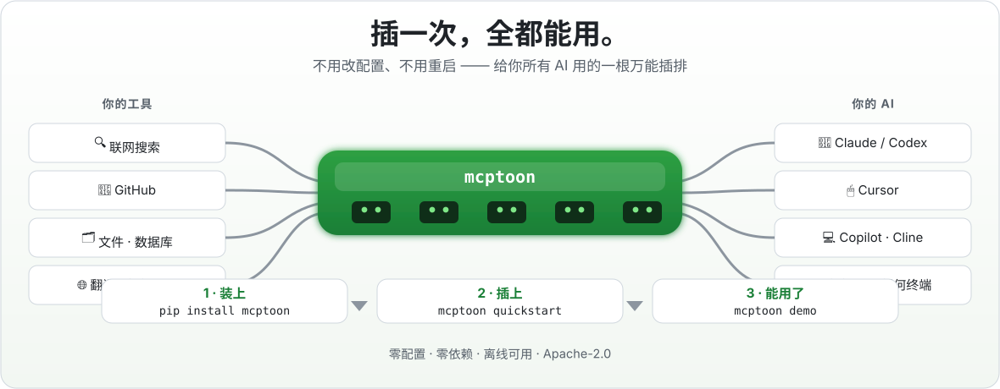
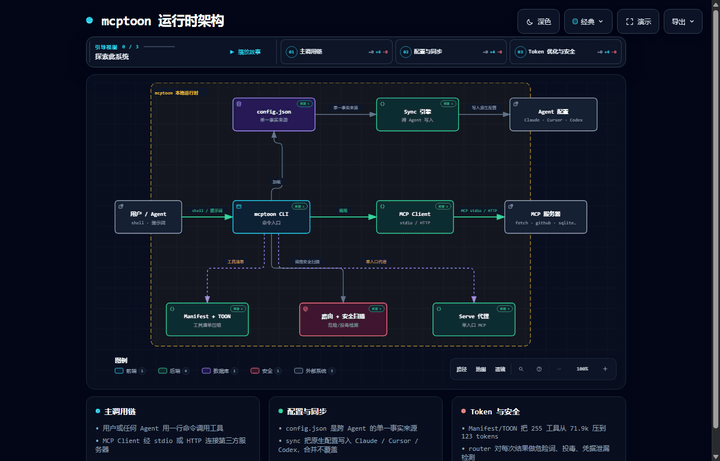
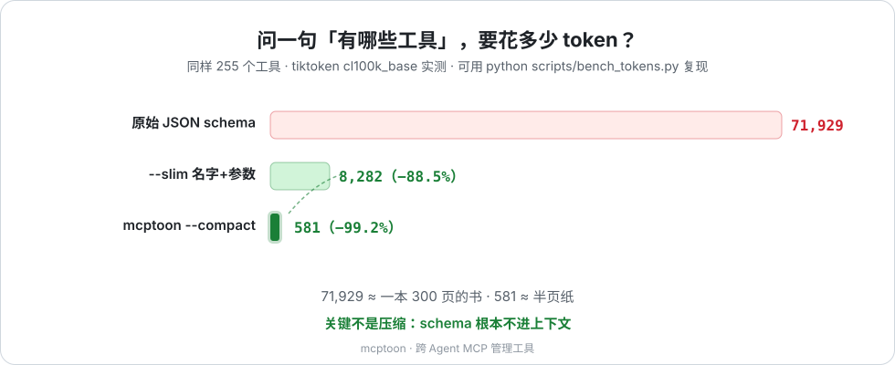

<div align="center" markdown="1">

# mcptoon — 跨 Agent MCP 管理工具

## **列出 255 个 MCP 工具要烧 71,929 tokens。mcptoon 的名字索引只要 581。**

*tiktoken cl100k_base 实测 · 自己复现：`mcptoon manifest --compact --tokens`*

<p align="center">
  
</p>

> ✅ **兼容最新 MCP 规范（2026-07-28）**——无状态自动协商、结构化输出原生解析、
> MRTR 多轮补参，`server/discover` 探测新版服务器，旧版全兼容开箱即用。

> 🧩 **兼容 Agent Plugins 规范 1.0.0**——Amazon / Cursor / Microsoft / OpenAI /
> Vercel 五大厂商背书的新一代插件打包标准，一条命令安装进**所有** AI Agent：
> `mcptoon plugin install <目录>`——包括没有原生插件加载器的 Agent。

[](https://pypi.org/project/mcptoon/)
[](https://pypi.org/project/mcptoon/)
[](https://github.com/activeing123/mcptoon/actions/workflows/ci.yml)
[](#给开发者)
[](#mcp-规范兼容性2026-07-28)
[](https://agent-plugins.org/specification)
[](#honest-limitations)
[](LICENSE)

[English](README.md) · [开发者文档](DEVELOPERS.md) · [Changelog](CHANGELOG.md) · [提 Issue](https://github.com/activeing123/mcptoon/issues)

### 看不见的 token 税

接 5 个 MCP 服务器，光列出工具就要烧掉 **~10,000 tokens** 的纯 JSON 语法。
20 次工具调用再搭进去 40,000-70,000 —— 全是括号、引号和 schema 声明，不是思考。
128K 上下文里 **30-55% 就这么没了**，Agent 还没开始干活。mcptoon 用名字目录
替代这堆 dump，tiktoken cl100k_base 实测：

| 工具清单（255 个工具） | tokens | 相对原始 JSON |
|---|---:|---:|
| 原始 JSON schema | 71,929 | — |
| `--slim`（名字+参数类型） | 8,282 | −88.5% |
| `--compact`（纯名字目录） | 581 | **−99.2%** |

## ⚡ 三步搞定，全平台通用 —— 无需任何配置

```bash
# 1 · 装上
pip install mcptoon

# 2 · 插上 —— 自动发现你已经配置过的工具
mcptoon quickstart

# 3 · 亲眼看着它工作 —— 不用信任何人，自己跑一遍
mcptoon demo
```

一键安装（不会折腾 Python？复制这行，脚本全搞定）：

```bash
curl -fsSL https://raw.githubusercontent.com/activeing123/mcptoon/main/install.sh | bash
```

```powershell
irm https://raw.githubusercontent.com/activeing123/mcptoon/main/install.ps1 | iex
```

> `mcptoon demo` 会在**你自己的电脑上**现场对比：工具清单从几万 token
> 缩成一张名字目录 —— 看完再决定用不用。

<p align="center"></p>

<p align="center">
  <a href="assets/promo-zh.mp4"></a>
  <br>
  <sub>🎬 <b>39 秒动画看懂 mcptoon</b> —— 开局一句话，痛点、装一次、自动发现、token 对比、安全把关全讲透 · 点击画面看高清版</sub>
</p>

```bash
pip install mcptoon        # 纯标准库，约 250KB，零依赖

mcptoon quickstart         # 找到你已配置的服务器，列出它们的工具
mcptoon demo               # 现场对比：JSON vs mcptoon，真实 token 数字
```

省 99.2% token · Windows / macOS / Linux · 免费开源（Apache-2.0）

</div>

---

## 🗺️ 运行架构（可交互）

下方是 mcptoon 的运行时架构图（基于真实源码生成，节点带 `SRC n` 可回看代码证据）。
点击预览图打开可交互版：支持搜索节点、追踪调用路径、对比语义角色、深浅主题切换与导出。

[](assets/architecture-zh.html)

---

## ⚡ 30 秒懂它（小白入口）

mcptoon 是一个跨 agent MCP 管理工具，装一次，所有 agent，
Claude Code、Cursor、Codex 全部开箱即可使用。

| 以前 | 用 mcptoon |
|------|-----------|
| 每个 Agent 单独配一遍 MCP，配错浪费时间 | 工具插一次，所有 Agent 直接用 |
| 改完要重启，还常配错 | 装上就能用，不用重启 |
| 记不清哪个 Agent 配过什么 | `quickstart` 自动找到你已有的工具 |
| 想换工具要挨个 Agent 改 | 一处修改，处处生效 |

**3 步装好（不用会写代码）：**

1. 装 Python：去 [python.org](https://www.python.org) 下载，勾选 "Add Python to PATH"
2. 复制回车：`pip install mcptoon`
3. 一键发现：`mcptoon quickstart`，再跑 `mcptoon demo` 亲眼看它在你机器上省多少

技术版本一句话：mcptoon 是一个零依赖 CLI，把任何 Agent 接到所有
MCP 服务器上，不管这个 Agent 支不支持 MCP。

---

## 🛠 30 秒评估它（技术员入口）

一句话架构：`~/.mcptoon/config.json` 是唯一事实来源，
`sync` 写进所有 Agent，`manifest` 按需给名字索引，`serve` 合成单入口代理。
零第三方依赖，Python 3.10+，纯标准库约 6,800 行。

### 别人没有的部分：Agent 端零配置

原生 MCP 意味着给每个 Agent 编辑一份 JSON，格式还各不相同：

| Agent | 配置文件 |
|-------|---------|
| Claude Desktop | `claude_desktop_config.json` |
| Claude Code | `.claude.json` |
| Cursor | `.cursor/mcp.json` |
| Cline / Windsurf / VS Code Copilot | 各种 JSON、各种格式 |

在 Cursor 加服务器，忘了 Claude；修好 Claude，弄坏 Cursor，每周循环。
代理工具则要你跑一个常驻服务，再把每个 Agent 指向它。

mcptoon 两者都不需要。它是你的 Agent 本来就会跑的程序：

```text
你:    "我们有哪些工具？然后抓取 https://example.com 总结一下"
Agent: $ mcptoon manifest --compact        ← 拿到名字索引，不是 schema
Agent: $ mcptoon call fetch fetch '{"url":"https://example.com"}'
```

没有 `mcpServers` 条目，没有插件 API，没有要注册的东西，没有要重启的东西。
想全自动？在 Agent 的指令文件（CLAUDE.md / AGENTS.md / 系统提示词）里写一行
就够——那是提示词，不是配置。

这也是 mcptoon 能到达 MCP 到不了的地方的原因：shell 脚本、CI 流水线、
cron 任务、aider、纯终端环境——一切能执行命令的东西。

### 三大动作

**1 · 配一次，处处同步：`sync`**
```bash
mcptoon add fetch --stdio npx -y @modelcontextprotocol/server-fetch
mcptoon sync                # 把原生配置写进每个检测到的 Agent
```
合并不覆盖，你手动配的服务器原地不动。一条命令得到跨 Agent 工具管理：
全机器 MCP 服务器的单一事实来源，不用在 Cursor、Claude 之间复制粘贴 JSON。

```bash
mcptoon sync --watch        # 轮询配置文件，任何变更持续对齐所有 Agent
mcptoon sync --dry          # 预览要写什么
mcptoon sync --agent cursor # 只写指定 Agent
```
漂移检测捕捉外部改动；merge/strict 两种模式。

**2 · 只为名字付费，schema 不进上下文：`manifest`**

Agent 问"有哪些工具？"，mcptoon 回一个名字索引。schema 留在
`~/.mcptoon/config.json` 磁盘上，从不进入上下文。

```bash
$ mcptoon manifest --compact
fetch: fetch · github: search_repos, get_file, create_issue · sqlite: query, execute
```



| 工具清单（tiktoken cl100k_base） | tokens | vs 原始 JSON |
|--------------------------------|-------:|-------------:|
| 原始 JSON schema（255 工具） | 71,929 | — |
| `--slim`（名字+参数类型） | 8,282 | −88.5% |
| `--compact`（仅名字） | 581 | **−99.2%** |

<sub>基于真实 255 工具配置（50 台服务器）用 tiktoken cl100k_base 实测。
你的组合数字会不同，复现命令：`mcptoon manifest --compact --tokens`。
71,929 tokens 约等于一本 300 页的书，581 tokens 约等于一段话。</sub>

这是旋钮不是开关：要零歧义随时 `--json`；`call` 结果默认纯文本且经过安全检查。
选型对比见 [docs/comparison.md](docs/comparison.md)（按类别拆解安装成本、token 成本、安全性）。

**3 · 每台服务器门前只开一扇门：`serve`**

让 Agent 指向单一入口，而不是 N 台服务器：

```json
"mcptoon": { "command": "mcptoon", "args": ["serve"] }
```

```bash
mcptoon serve                  # stdio，单 Agent
mcptoon serve --listen :8080   # HTTP，多 Agent 同时连 / 远程机器可用
```

### 并发与稳定性

- **并行发现**：20 并发 worker 加载 manifest，100 台服务器约 5 秒（串行要 500 秒）
- **schema 缓存 5 分钟**：重复发现不重复付钱
- **单调用 30 秒超时**（`MCPTOON_CALL_TIMEOUT` 可调）：一台服务器卡死不拖垮整个会话
- **多 Agent 同时连**：HTTP 模式并发请求线程隔离，响应不串台
- **并发安全记账**：使用记录线程锁 + 原子写，多 Agent 并发跑不损坏 `usage.json`

## MCP 规范兼容性（2026-07-28）

mcptoon 0.7.0 说的是**最新 MCP 规范 [2026-07-28](https://github.com/modelcontextprotocol/modelcontextprotocol/releases/tag/2026-07-28)**——
无状态化那一版——同时完全兼容所有旧版服务器：

| MCP 修订版 | mcptoon 支持 |
|-----------|-------------|
| **2026-07-28**（最新 · 无状态） | ✅ `server/discover` 自动协商 · 每请求 `_meta` 协议标注 · `Mcp-Method`/`Mcp-Name` HTTP 标准头 · MRTR 多轮补参（`resultType: "input_required"` → `--input-responses` 应答重试） |
| 2025-11-25 / 2025-06-18 | ✅ 经典 `initialize` 握手 · `structuredContent` 原生解析 · `--envelope` 透传 |
| 2025-03-26 / 2024-11-05（旧服务器） | ✅ 行为不变，完全向后兼容 |

版本选择全自动（`spec="auto"`）：客户端先用 `server/discover` 探测，
服务器不认识就静默回落经典握手。也可以在 `~/.mcptoon/config.json` 里按服务器
钉死：`spec: "legacy"` 或 `spec: "2026-07-28"`。

```bash
mcptoon call db query '{"sql":"SELECT 1"}' --envelope   # 完整 MCP 结果信封，JSON 输出
mcptoon call deploy run '{}' --input-responses '{"env":"prod"}'   # MRTR 多轮补参重试（2026-07-28）
```

日常使用不需要任何新参数：新规范服务器返回结构化输出时 mcptoon 自动识别。
需要原始协议载荷（审计、调试、查 `_meta`）时才用 `--envelope`。

## Agent Plugins 插件支持（1.0.0）

[Agent Plugins 规范](https://agent-plugins.org/specification) v1.0.0（Amazon、Cursor、
Microsoft、OpenAI、Vercel 五大厂商共同制定）定义了 AI Agent 插件怎么**打包**——
一个文件夹，装着 `plugin.json`（身份证）+ `skills/`（说明书）+ `mcp.json`（工具配置）。
它刻意**不**定义安装、分发、跨 Agent 同步——这正好是 mcptoon 的本职：

```bash
mcptoon plugin scan <目录>       # 校验插件包（只读）
mcptoon plugin install <目录>    # 装进 mcptoon + 所有已接管的 Agent
mcptoon plugin list              # 看装了什么
mcptoon plugin remove <名称>     # 处处移除（数据目录保留）
```

- **严格规范校验**——闭式清单、单 token 命令、非环回强制 HTTPS、headers 禁放凭据、路径逃逸检查
- **`${PLUGIN_ROOT}` / `${PLUGIN_DATA}` 预展开**——mcptoon 自己当安装者，直接把绝对路径
  写进每个 Agent 的原生配置，Agent 侧零插件加载器支持
- **命名空间服务器**——`插件名:服务器名` 键名防撞，卸载时把它到达过的每个 Agent 配置都清干净
- **数据目录持久化**——`~/.mcptoon/plugins-data/<名称>/` 跨升级保留（规范 §PLUGIN_DATA），
  `--force` 强制升级也不会丢缓存和状态
- 插件服务器与普通服务器落在同一份 `~/.mcptoon/config.json`——`manifest`、`call`、
  `serve`、`health` 和 99.2% 省 token 对它们自动生效

### 盒子里还有的一切

| 命令 | 作用 |
|------|------|
| `mcptoon sync --watch` | 轮询配置，跨 Agent 持续重同步 MCP 服务器 |
| `mcptoon call <server> <tool> '{…}'` | 调任意服务器上的任意工具 |
| `mcptoon call <server> <tool> --envelope` | 返回完整 MCP 结果信封（structuredContent、_meta） |
| `mcptoon call --auto <tool> '{…}'` | 只给工具名，自动路由到正确服务器 |
| `mcptoon plugin install <目录>` | 一条命令把 Agent Plugin 装进所有 Agent（规范 1.0.0） |
| `mcptoon health` | 哪些服务器活着、死了、多快；CI 里全死退出码 1 |
| `mcptoon install <name> --npm <pkg>` | 装服务器并自动发现工具 |
| `mcptoon search <query>` | 跨全部工具模糊搜索 |
| `mcptoon doctor` | 自检 Python、配置、连通性 |

`health` 为什么重要：2026 年社区审计发现
[52% 已发布的 MCP 服务器不可达](https://www.163.com/dy/article/KSSN2L5E05561FZP.html)。
配置了 ≠ 活着。

```text
── mcptoon health: 3/5 alive ──────────────
  ✓ fetch     [stdio]  1 tool     120ms  ok
  ✗ brave     [stdio]  0 tools  10002ms  timeout → Timed out after 10s
  ✓ github    [http]  12 tools    340ms  ok
```

**底层细节**

- **Agent 能行动的报错**：每次失败返回结构化信封带修复建议
  （"server `fetchh` not found — did you mean `fetch`?"），Agent 自我纠正而不是卡死等你救
- **持续同步（`--watch`）**：漂移检测，merge/strict 模式
- **跨服务器模糊搜索**：`mcptoon search star` 带相关性评分找对工具
- **Shell 补全**：bash / zsh / fish / PowerShell
- **JSON 或 TOML 配置**：都在 `~/.mcptoon/`，哪个顺眼用哪个
- **本地使用记录**：哪些工具何时被调过，记录永不出你的机器

### 安全扫描，应用于每次调用

零依赖免费送供应链安全：没有 npm 子树、没有 postinstall 脚本、
没有要审计的东西，只有约 6,800 行可读的 Python。

MCP 服务器在你机器上跑代码，还会把任意文本塞进 Agent 上下文。
mcptoon 在文本到达 Agent 之前检查每一次结果：

| 检查 | 拦截内容 |
|------|---------|
| 提示词注入 | 工具输出里埋的 "ignore previous instructions" |
| 凭据泄漏 | 输出中的 `sk-…` / `AKIA…` / `ghp_…` 特征 |
| 危险操作 | 名带 `delete` / `drop` / `purge` 的调用，除非显式 `--destructive` |

无遥测、无统计、无外呼。API Key 只从你的配置或环境变量透传，mcptoon 绝不存储。

### 学术与行业验证

这些独立来源验证 mcptoon 解决的问题：

| 引用 | 来源 | 结论 |
|------|------|------|
| SEP-1576 | [modelcontextprotocol issue #1576](https://github.com/modelcontextprotocol/modelcontextprotocol/issues/1576) | MCP 官方提案：schema 冗余削减 + 更聪明的工具选择，验证零 token 方向 |
| Firecrawl 基准 (2026) | [firecrawl.dev/blog/mcp-vs-cli](https://firecrawl.dev/blog/mcp-vs-cli) | 同样任务 CLI 约 200 tokens，MCP 约 44K，贵 4~32× |
| Anthropic code-execution | [anthropic.com/engineering/code-execution-with-mcp](https://www.anthropic.com/engineering/code-execution-with-mcp) | 代码执行模式削减上下文开销至 98.7%（150K→约 2K tokens） |
| MCP-Zero（厦门大学+中科大） | [arXiv:2506.01056](https://arxiv.org/abs/2506.01056) | 按需工具检索实现与工具数量无关的常数成本 |
| ProMCP（ACL ARR 2026） | arXiv | MCP Agent 的 token 流与延迟剖析 |
| Microsoft 动态工具发现 | [Microsoft Learn](https://learn.microsoft.com/en-us/microsoft-365/copilot/extensibility/plugin-dynamic-tool-discovery) | 动态工具发现是 MCP 客户端的 token 效率模式 |
| Scalekit (2026) | [scalekit.com/blog/mcp-vs-cli-use](https://scalekit.com/blog/mcp-vs-cli-use) | 确认 MCP 与 CLI 之间 32× token 成本差 |

### Works with

**Claude Desktop · Claude Code · Cursor · Cline · Windsurf · VS Code Copilot ·
Codex · Gemini CLI · OpenCode**，外加 aider、shell 脚本、CI 任务，以及一切
能执行命令的东西，包括完全不支持 MCP 的环境。CLI 优先就是这个意思。

<details markdown="1">
<summary><strong>和原生配置、工具搜索代理比，差在哪？</strong></summary>

| | 每个 Agent 单独配 | 工具搜索代理 | mcptoon |
|---|---|---|---|
| Agent 端安装 | 每个 Agent 编辑 JSON + 重启 | 跑一个服务，Agent 指向它 | **零——它就是一条命令** |
| 维护文件数 | 每个 Agent 一份 | 每个 Agent 一份 | **一份，处处同步** |
| 发现成本 | 全量 schema | 先搜索再按需加载 | **名字索引，schema 永不出磁盘** |
| 死服务器检测 | 无 | 看实现 | 内建，CI 友好退出码 |
| 输出检查 | 无 | 看实现 | 每次调用做注入 + 泄漏检查 |
| 采用方式 | 原生支持 | 跑一个服务 | `pip install mcptoon` |

还能组合：要代理形态的时候，`serve` 模式就是。

</details>

---

## ❓ FAQ

<details markdown="1">
<summary><strong>常见问题</strong></summary>

**什么是跨 Agent MCP 管理工具？**
管理多个 AI Agent 的 MCP 服务器配置的工具。mcptoon 是开源实现之一：一份配置同步到所有 Agent，不用逐个编辑 JSON，也不用常驻代理服务。

**mcptoon 怎么帮我省 token？**
Agent 问"有哪些工具"时只回一个名字索引（255 个工具 = 581 tokens），完整 schema 留在磁盘不进上下文。255 个工具从 71,929 降到 581，省 99.2%。

**这不就是压缩吗？**
不是。压缩把完整载荷送进上下文再解压，成本迟早落进窗口。mcptoon 把 schema 留在磁盘，它们根本不进上下文，Agent 看到的只是一份短短的名字索引。

**Claude Code 已经延迟加载 MCP 工具了，还有必要吗？**
有。延迟加载决定"何时加载"，mcptoon 决定"清单花多少 token"，且对所有 Agent 同时生效，还叠加 sync、health、安全检查。两者解决不同层，可以叠加。

**为什么是 CLI 而不是库或代理？**
因为 shell 是所有 Agent 都已经会说的唯一接口。没有插件 API、没有 SDK、没有每 Agent 配置文件、没有要保活的服务，连完全不支持 MCP 的 Agent 也能通过它驱动所有 MCP 服务器。要长连接？`mcptoon serve` 就是代理形态的同一个工具，stdio 或 HTTP。

**省 token 是靠把 `null` 换成符号之类的把戏吗？**
不是，那是早期 TOON 式实验留下的误解。头条数字来自架构：完整 schema 根本不发。可选的 `--toon` 对工具**输出结果**编码再省约 30~40%，默认关闭。

</details>

<details markdown="1">
<a id="honest-limitations"></a>
<summary><strong>坦诚的局限</strong></summary>

- `--compact` 只列工具**名字**，没有描述和参数。要签名用 `--slim`，要全部用 `--json`。
- token 数字用 tiktoken `cl100k_base` 实测，其他分词器有 ±10~25% 出入。核心节省（schema 根本不进上下文）与分词器无关。
- stdio 每次调用起一个进程（约 300ms 冷启动），高频路径用 `serve` 模式，schema 缓存吸收 5 分钟内的重复列表。
- 终端优先，没有 GUI。

</details>

---

<a id="for-developers"></a>

## 👨‍💻 给开发者

```python
from mcptoon.client import MCPClient

with MCPClient(stdio=["npx", "-y", "@modelcontextprotocol/server-fetch"]) as c:
    tools = c.list_tools()
    result = c.call_tool("fetch", {"url": "https://example.com"})
```

```bash
git clone https://github.com/activeing123/mcptoon.git && cd mcptoon
pip install -e . --no-build-isolation && pip install pytest
python -m pytest tests/ -v          # 681 个测试，预期全绿
docker run --rm -v ~/.mcptoon:/root/.mcptoon mcptoon manifest --compact
```

零第三方导入是 review 强制执行的红线。新功能必须带测试。
约 6,800 行 Python、14 个模块，见 [CONTRIBUTING.md](CONTRIBUTING.md)。

## License

Apache 2.0，见 [LICENSE](LICENSE) 与 [NOTICE](NOTICE)。

<div align="center" markdown="1">

*Model Context Protocol 的独立第三方客户端。与 Anthropic、Cursor、Microsoft 无隶属关系。*

**如果 mcptoon 今天帮你省了 token，一个 ⭐ 能让更多人找到它**

</div>
