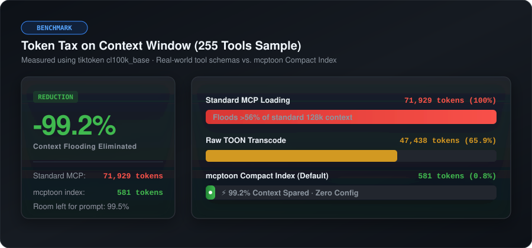

<!-- mcp-name: io.github.activeing123/mcptoon -->
<div align="center" markdown="1">

<picture>
  <source media="(prefers-color-scheme: dark)" srcset="https://raw.githubusercontent.com/activeing123/mcptoon/main/docs/assets/lockup-h-split-dark.svg">
  
</picture>

<h3 align="center">MCP 工具与 Agent 技能的零配置 Token 压缩与统一调度网关</h3>

<p align="center">
  <b>在本地安装 1,000 个技能和 1,000 个 MCP 工具 — 彻底告别上下文爆仓。</b><br>
  独创轻量格式将工具上下文缩减 ~90%（255 工具样本降幅达 99.2%），<b>覆盖 103+ 款主流桌面与终端 Agent</b> 全自动零配置。
</p>

<!-- 核心权威徽章 -->
<p align="center">
  <a href="https://pypi.org/project/mcptoon/"></a>
  <a href="https://github.com/activeing123/mcptoon/stargazers"></a>
  <a href="https://github.com/activeing123/mcptoon/actions"></a>
  <a href="#贡献指南"></a>
  <a href="https://github.com/activeing123/mcptoon"></a>
  <a href="LICENSE"></a>
</p>

<!-- 生态与目录收录徽章 -->
<p align="center">
  <a href="https://modelcontextprotocol.io"></a>
  <a href="https://allmcps.com/mcp/mcptoon?verify=7eb0d0d6-5d4e-41a3-a048-2fe3c91a36ed"></a>
  <a href="https://mcpvault.io/servers/mcptoon/health"></a>
  <a href="https://mcpservers.org/servers/activeing123/mcptoon"></a>
</p>

<p align="center">
  <b><a href="https://activeing123.github.io/mcptoon/">🌐 官方网站</a></b> · 
  <b><a href="https://activeing123.github.io/mcptoon/tools/token-tax/zh/">🧮 30秒 Token 浪费计算器</a></b> · 
  <b><a href="https://github.com/activeing123/mcptoon/blob/main/README.md">🇺🇸 English README</a></b> · 
  <b><a href="https://github.com/activeing123/mcptoon/blob/main/DEVELOPERS.md">📖 开发者文档</a></b>
</p>

<!-- 现代化 Benchmark SVG -->
<p align="center">
  
</p>

</div>

### ⚡ 全能力全景速览

| 💰 Token 极致压缩与成本节流 | 🛠️ MCP 工具统一纳管与调度 |
| :--- | :--- |
| • ✅ **Schema 极致瘦身 (-99.2%)**：7.1 万 Token 缩减至 581 Token 极简名字索引<br>• ✅ **结果智能无损压缩 (CCR)**：自动裁剪冗余输出，原件支持 100% 句柄取回 (`retrieve`)<br>• ✅ **会话级重复结果过滤**：同一次对话相同输出自动转引用，杜绝重复扣费<br>• ✅ **真实数据度量 (`bench`)**：内置 `tiktoken` 精确核算本机真实节省 Token 数 | • ✅ **17,000+ 社区工具发现**：支持大白话自然语言检索工具注册表 (`search`)<br>• ✅ **统一命令行执行 (`call`)**：无论目标服务用何种语言编写，均可直接驱动<br>• ✅ **按需参数拉取 (`inspect`)**：仅在 Agent 决定调用时才毫秒级拉取 Schema<br>• ✅ **健康体检自愈 (`doctor`)**：一键排查 stdio 管道、网络连通性与配置冲突 |

| 🧠 技能统一分发与离线治理 | 📚 长文档与开发规范零税路由 (`mcptoon docs`) |
| :--- | :--- |
| • ✅ **一套技能，多端共享 (`sync`)**：软链分发给 Claude, Cursor, Roo, OpenCode<br>• ✅ **自带官方内置技能**：安装即自带 `/mcptoon` 技能手册，Agent 自动学习<br>• ✅ **本地离线 BM25 路由 (`resolve`)**：5 毫秒锁定匹配手册，0 模型 API 成本<br>• ✅ **严格版本门禁 (`--version-gate`)**：改动内容但未升版本号时自动拦截<br>• ✅ **防复活墓碑机制 (`--tombstone`)**：永久下线废弃技能，防 Git 拉取复活 | • ✅ **长文档目录树自动索引 (`index`)**：为大型规范与文档目录生成极简索引<br>• ✅ **按需章节投喂 (`resolve`)**：Agent 提问只返回对应单篇路径，免读全书<br>• ✅ **无外部依赖与向量库**：纯本地毫秒级 BM25 关键词匹配引擎<br>• ✅ **上下文税强力护盾**：实测将 4 万 Token 规范文档查询压减至 1.7 万 |

| 🔌 覆盖 103+ 款 AI 客户端 | 🛡️ 极致轻量与工程纪律 |
| :--- | :--- |
| • ✅ **103 款客户端开箱即用**：Claude Code, Cursor, Windsurf, Zed, Cline...<br>• ✅ **CLI 原生 + 标准 MCP 双模**：42 款命令行直通 + 61 款 serve 代理回退<br>• ✅ **会话末尾透明播报 (`footer`)**：每轮对话直观展示当前省下的 Token 真实数字 | • ✅ **绝对零第三方依赖**：100% 纯 Python 标准库编写，依赖项为空<br>• ✅ **极致轻巧 (362KB)**：一条命令 2 秒安装完毕，卸载干干净净<br>• ✅ **100% 离线与隐私保护**：所有算法与索引完全单机运行，数据绝不上云<br>• ✅ **严格遵守 XDG 规范**：无缝支持沙盒、自定义 `--dir` 与环境隔离 |

---

### 🚀 快速上手（选择你喜欢的方式）

<table>
<tr>
<td width="50%" valign="top">

<h4>🤖 现代化方式：直接跟 Agent 对话（免记命令）</h4>

mcptoon 安装后**会自动将官方技能（`/mcptoon`）注入到所有检测到的 Agent 目录中**。小白完全不需要背诵任何命令，在 **Cursor, Claude Code, Windsurf, DSH** 聊天框直接对话：

```markdown
# 随时唤醒内置技能，有问题直接问：
"加载 /mcptoon 技能，看一下我现在都有哪些 MCP 工具？"
"帮我找一个能把网页转成 Markdown 的 MCP 工具并执行。"
"刚才工具返回的日志被截断了，用 mcptoon 把完整原件调出来。"
"算一下今天 mcptoon 帮我省了多少 Token？"
"帮我体检自查一下：所有 MCP 服务器连通性正常吗？"
```
*Agent 会自动调取 `/mcptoon` 技能手册，在后台替你完成所有操作！*

</td>
<td width="50%" valign="top">

<h4>⚡ 终端极客方式：30 秒搞定</h4>

```bash
# 1. 一键安装（零依赖，362KB）
pip install mcptoon

# 2. 一键检测并自动配置已安装的 Agent
# （同时自动将 `/mcptoon` 技能分发到各大 Agent 目录中）
mcptoon quickstart

# 3. 查看极简工具索引（省 99.2% Token）
mcptoon manifest

# 4. 路由任务对应的技能或规范章节（<5ms）
mcptoon skills resolve "写 git 提交信息"
mcptoon docs resolve "版本发布门禁怎么运作"
```

</td>
</tr>
</table>

---


## 为什么要用 mcptoon

每个 MCP Agent（Claude Code、Cursor、Codex……）在干活之前，都会把**每个工具、每个技能的完整描述加载进上下文窗口**——而且每轮重发一次。255 个工具就是 **71,929 tokens**：128K 的窗口，一半还多，还没问第一个问题就花在了"描述"上。

## 省 token 的原理

mcptoon 把这些描述**留在磁盘上、不放进上下文**，只交给 Agent 一份紧凑视图：

- **给名字索引，不给完整 schema。** 挑工具只需要名字——255 个工具压成 **581 tokens（−99.2%）**。完整 schema 用 `mcptoon inspect` 按需取，只在真正调用某个工具时才取。
- **技能同理。** 常驻一条指针（**39 tokens**）+ 一次查询（**501 tokens**），取代加载每一份 `SKILL.md` 全文——**926,232 → 39 + 501（−99.9%）**。
- **结果也一样。** `--toon` 把工具*结果*重新编码成标准 TOON。混合样本实测比 JSON 小
  **5.7%**，按结果形状在 **1.8%–48.6%** 之间——记录列表几乎不变，单条记录能减半。
  不是稳定的 34%，见 `assets/benchmark_results.json`。

什么都不丢：完整 schema 和完整技能全文，永远只差一条命令。省下的只有上下文窗口。

mcptoon 是一个 **362KB、零依赖的原生 CLI**，管理你电脑上的每个 MCP 工具和 Agent 技能——并让它们在你所有 Agent 之间共享，而你一行配置都不用写。

## 不只我们一家这么说

这些数字是我们测的——但「把每个工具的 schema 都塞进上下文很贵」不是只有我们在说：

- **[Anthropic 工程博客](https://www.anthropic.com/engineering/code-execution-with-mcp)** —— 工具 schema 淹没上下文是真实成本；一个例子从 150,000 token 降到 2,000
- **[Firecrawl 基准](https://firecrawl.dev/blog/mcp-vs-cli)** —— 同一件事：命令行 1,365 token，MCP 44,026 token（32 倍）
- **[Scalekit 基准](https://scalekit.com/blog/mcp-vs-cli-use)** —— 命令行便宜 10–32 倍，可靠性 100% 对比 MCP 的 72%
- **[MCP-Zero（arXiv:2506.01056）](https://arxiv.org/abs/2506.01056)** —— 按需取工具，成本与工具总数几乎无关

mcptoon 是今天就能用的那个：能跑 shell 的 Agent 全都覆盖，认得出的主流桌面客户端各写一行登记。

---

## 两条路径

<table>
<tr>
<td width="50%" valign="top">

<h3>🧑‍💻 我只是 AI 工具的用户</h3>

装一次，你电脑上每个 AI——**Claude Desktop、Claude Code、Codex、Cursor、Windsurf、Cline、VS Code Copilot、Gemini CLI、Qwen Code、Zed、Crush、opencode 等任意 Agent**——就都能共用你原有的全部工具和技能。任何 Agent 的配置，你都不用写。

**[→ 安装即用](#30-秒上手)**

</td>
<td width="50%" valign="top">

<h3>🔧 我在做 MCP / Agent 开发</h3>

当脚本用。`mcptoon` 是一个纯 CLI，输出稳定的 JSON，还能用 `mcptoon serve` 起一个 MCP 端点——接进你自己的 agent、CI 或应用。

**[→ 命令与格式](#全部命令)**

</td>
</tr>
</table>

量你自己的数字：`pip install mcptoon && mcptoon bench` —— 它报的是你本机的目录，不是下面这份固定的 255 工具样本。

| | 没有 mcptoon | 用 mcptoon |
|---|---|---|
| **进上下文的描述** | 每个工具 + 技能的完整描述，每轮重发 | 一份紧凑视图——255 个工具只要 **581 tokens**（−99.2%，无损） |
| **加一个工具或技能** | 在每个 Agent 里手写 JSON | 一条命令，不碰任何 Agent 配置 |
| **哪些 Agent 能用上** | 只有你配过的那些 | 机器上每个 Agent——它们直接跑 `mcptoon` |
| **去哪找工具和技能** | 手动翻 GitHub | `install --search`（**17,000+ 个 MCP 服务器**）+ `skills search` |
| **从零开始** | 一个工具一个工具地接 | 4 个内置起步包——一条命令搭出可用组合 |

技能同理：**926,232 tokens** 的 `SKILL.md` 全文 → 常驻 **39** + 每次查询 **501**（−99.9%）。调用结果加 `--toon` 再省 **~6%**（随形状 1.8%–48.6%）。

---

## 路径一 · 我只是 AI 工具的用户

你有一个桌面 AI——Claude、Codex、Cursor、Windsurf、Cline、VS Code Copilot，**还有另外 97 个**（[103 个完整名单 →](#所有-ai-agent-都能用)）。今天，加一个工具或技能，就得去手改那个 Agent 的 JSON。mcptoon 把这步去掉：

1. **装一次。**
   ```bash
   pip install mcptoon && mcptoon quickstart
   ```
   `quickstart` 会找到你的 MCP 服务器、写好配置，并在它检测到的每个 Agent 里注册 mcptoon。
   （不跑 `quickstart` 也没关系：你跑的第一条命令会自愈——把 mcptoon 自己的技能装进每个 Agent 并建好技能索引，每台机器只做一次。）

2. **工具和技能只在一个地方加**——这里，不是每个 Agent 里。
   ```bash
   mcptoon install --search github     # 找并安装任意 MCP 服务器
   mcptoon skills search "做个 PDF"     # 按技能能做什么来找
   ```

3. **任何 Agent 都能用。** 你的 Agent 像跑其它命令一样跑 `mcptoon`——不用配置、不用重启。见 [所有 AI Agent 都能用](#所有-ai-agent-都能用)。

**想要开箱即用？** 四个内置起步包——`essentials`、`web-research`、`code-review`、`docs`——一条命令搭出一套能用的工具组合：

```bash
mcptoon install --pack essentials
```

---

## 路径二 · 我在做 MCP / Agent 开发

mcptoon 是一个纯 CLI，输出可脚本化；需要时还能起一个 MCP 端点。

```bash
mcptoon manifest --format json      # 机器可读的工具索引
mcptoon call <server> <tool> '{}'   # 调任意工具，JSON 或 --toon 输出
mcptoon serve                       # 把所有已配置的服务器收在同一个 MCP 端点后
```

- **输出稳定**——默认 JSON，`--toon` 结果再小一点（随形状 1.8%–48.6%，混合样本 5.7%），`--format mcp` 导出标准 MCP JSON。
- **`mcptoon serve`**——stdio 或 HTTP、连接池、按 Agent 分发的 key，给那些坚持要走代理的客户端。
- **零依赖**——纯 Python 标准库，任何环境都能塞进去（CI、容器、内网）。

完整参考：[DEVELOPERS.md](https://github.com/activeing123/mcptoon/blob/main/DEVELOPERS.md) 与 [全部命令](#全部命令)。

---

## 目录

- [为什么要用 mcptoon](#为什么要用-mcptoon)
- [省 token 的原理](#省-token-的原理)
- [不只我们一家这么说](#不只我们一家这么说)
- [两条路径](#两条路径)
- [30 秒上手](#30-秒上手)
- [它做什么](#它做什么)
- [工具从哪来](#工具从哪来搜-17000一条命令装上)
- [三笔账](#三笔账为什么不能混着比)
- [安装方式](#安装方式)
- [所有 AI Agent 都能用](#所有-ai-agent-都能用) — **103 个客户端**（CLI 42 · serve 61）
- [为什么是 CLI，不是代理](#为什么是-cli不是代理)
- [全部命令](#全部命令)
- [信任与安全](#信任与安全)
- [引用与致谢](#引用与致谢)
- [贡献](#贡献)
- [许可证](#许可证)

---

## 30 秒上手

```bash
pip install mcptoon                          # 纯标准库，362KB，零依赖

# 一条命令：扫出你的 MCP 服务器、写好配置、把网关登记进你所有 Agent，并告诉它发现了什么：
mcptoon quickstart

# 查看所有可用工具（默认就是名字索引，255 个工具只需 581 token）：
mcptoon manifest

# 调用工具（默认输出 JSON；想更省加 --toon）：
mcptoon call everything echo '{"message":"hi"}'
```

`quickstart` 也是让 mcptoon **被看见**的那一步：它把 `mcptoon serve` 作为一个名为 `mcptoon` 的保留服务器写进每个 Agent 的配置，于是你的 Agent 能看见 mcptoon 本身。已经同步过？用 `mcptoon sync --self` 重新登记（不带 `--self` 的 `mcptoon sync` 只写你自己的服务器）；任何时候用 `mcptoon status` 看状态。

**两条路都通 —— 而且不用你选。** mcptoon **首先是个 CLI**：能敲命令的 Agent 直接跑 `mcptoon`，这是最省的一条路——schema 根本不进上下文。`quickstart` 还会把 mcptoon 自己的 MCP 条目（`mcptoon serve`）登记进每个收得下的 Agent，让只认 MCP 服务器的客户端也能用上你的工具。MCP 那条默认走 `compact` 档：不把上游工具清单塞进模型上下文，改成让它走 `mcptoon_manifest → inspect → call`。`mcptoon status` 两条账一起看。

**而且它完全可逆。** 安装会登记网关，默认还会「接管」——把你已有的服务器改走网关、摘掉它们原来的直连记录（不摘的话，同一批工具会同时以直连和网关两种身份出现，反而更贵）。这一步会列清单、要你确认一次，而且能撤销：**`mcptoon restore` 摘掉网关记录、把你的服务器原样放回去**；你之后往配置里加的东西一概不动。`mcptoon off` 是更轻的开关——只摘网关记录，服务器留在原地。两者都能加 `--dry` 预览；`mcptoon uninstall --dry` 会先打印完整移除计划。

还不想装？那就先看它干活（需要 Node）：

```bash
uvx mcptoon demo --quick
```

它会启动官方 "everything" 参考服务器，调一个工具，把 token 账打在屏幕上——不要 API key，不动你的服务器，不往磁盘写任何东西。

---

## 它做什么

### 工具：schema 按需取

完整 schema 压成名字索引。要用哪个，先 `mcptoon inspect` 查它的真实参数，再 `call`。你付的是一份清单的钱，不是每一轮的钱。

### 技能：常驻一份指针

不再全量加载。常驻一行指针（39 token），一次查询返回最相关的技能（501 token）。视图是**链接**（Windows 上是 junction，不需要管理员），所以改一处，处处生效，没有第二份副本会走样。

### 一次安装，全部共享

装一次 mcptoon，机器上每个 AI 都拿到你全部的工具和技能。之后新增，立即生效——不用重启 Agent，不用逐个写 JSON。

### 怎么添加工具

```bash
mcptoon install brave-search --npm @modelcontextprotocol/server-brave-search
mcptoon install my-tool --pip mcp-my-tool
mcptoon install remote-api --url https://example.com/mcp
mcptoon add my-server --stdio npx -y @any/mcp-package
mcptoon install --list                       # 看装了哪些
mcptoon install --remove brave-search        # 卸载其中一个
```

从 npm / pip / HTTP，一条命令加一个服务器。或者让 mcptoon 扫描你机器上已有的：`mcptoon discover`。

需要 token 的远端服务器从环境变量里取，凭据不落盘：

```bash
mcptoon install remote-api --url https://example.com/mcp \
  --header 'Authorization: Bearer ${BAIZHI_TOKEN}'   # BAIZHI_TOKEN 设在你的环境变量里
```

`${NAME}` 在**请求时**才解析，所以配置、生成的 handler、日志里留的都是模板——轮换变量后下一次调用即用新值，无需重装。变量缺失或为空会**报错并点名变量**，绝不会变成空 header。

---

## 工具从哪来——搜 17,000+，一条命令装上

开一台新机器，第一个问题不是「怎么省 token」，是「我到底该装哪些工具」。传统做法是去 GitHub 到处翻 `mcpServers` 片段，再手抄进 JSON。

mcptoon **不预装任何工具，也不把清单打包进程序**。它直连上游注册表，你要什么就搜什么：

```bash
mcptoon install --search github     # 搜，只列不装
mcptoon install --search postgres
mcptoon install github              # 搜到就直接装
```

结果带 `✓`（注册表验证过）、类型标签（`npm` / `pypi` / `hosted` / `remote`）和调用量。数据来自两个上游，**实时查、不落库**：

| 来源 | 是什么 | 规模 |
|---|---|---|
| [Smithery](https://smithery.ai) | 最大的 MCP 注册表 | **17,000+** 条 |
| [官方 MCP Registry](https://registry.modelcontextprotocol.io) | 官方元注册表 | 可安装的 npm / pypi 包 |

**为什么不在程序里内置清单**：内置就得发版才能更新，还会把别人的源码带进你的供应链。mcptoon 只存**指针**——搜到之后写一行配置进你自己的 `~/.mcptoon/config.json`，第三方源码永远不落进 mcptoon。

装完分发给所有 Agent：

```bash
mcptoon sync          # 把新工具推给每个检测到的 Agent
mcptoon manifest      # 看全部工具（名字索引，最省 token）
```

**怎么看结果**：索引里既有官方 `@modelcontextprotocol/*` 服务器，也有个人发布的包。`✓` 表示注册表验证过这条记录——这是提醒你，给凭据之前先看一眼源码。

**技能那一半**：`skills search <关键词>` 直连开放的技能索引（skills.sh）——按技能能做什么来找，再用 `skills add <git-url>` 装。mcptoon 装的是**你指定**的技能仓库——目录就是开放的生态本身。

**起步技能包**：如果你不想一个工具一个工具地挑，内置四个包——`essentials`、`web-research`、`code-review`、`docs`——每个都打包了几个工具外加一段现成提示词。`mcptoon install --packs` 列出它们；`mcptoon install --pack essentials` 安装其中一个。两个研究类包都不需要 API key。

---

## 三笔账：为什么不能混着比

mcptoon 省下的 token 分三处，混在一起比数字没有意义。

「省了多少」有两个读法，回答的是两个不同的问题。**网关口径**——完整 schema 对比 agent 默认 `compact` 暴露下真正加载的东西——才是装上 mcptoon 买到的那个数，是诚实的头条（本机实测 89%）。**瘦身 schema 口径**（同一批工具、描述更短）是更小的次要口径（88.5%），对应 `manifest --slim`。`mcptoon status` 把两者并排打印，来自同一次测量，因此永远不会各说各话。

### 第一笔 · 工具发现（`manifest`）：默认省 99.2%

`mcptoon manifest` 不带参数就是这一档。想要更多：`--slim`（名字加参数类型，8,282 token，−88.5%）或 `--full`（完整 schema）。

### 第二笔 · 调用结果（`call`）：可选，`--toon` 省约 6%

这笔账在工具返回结果**之后**到期。`mcptoon call` 默认输出 JSON，**默认不省**。想省就加 `--toon`。

### 第三笔 · 技能目录（`skills`）：926,232 → 常驻 39 + 每次查询 501

```bash
mcptoon skills manifest                      # 39 token，常驻
mcptoon skills resolve "做个 PDF" --k 5      # 501 token，返回最相关的 5 个
```

**一张表，三笔全在里面（写这份 README 的机器上实测）：**

| 路径 | Agent 加载什么 | token | 对比全量 |
|---|---|---:|---:|
| 工具 schema（1109） | 每份完整 schema | 139,863 | — |
| | `manifest`（名字索引） | 5,406 | 96.1% |
| | `manifest --slim` | 16,396 | 88.3% |
| 技能文件（371） | 每个 `SKILL.md` 全文 | 926,232 | — |
| | `skills manifest`（指针） | 39 | 100.0% |
| | `skills resolve --k 5` | 501 | 99.9% |

固定口径的头条基准——一份**合成样本**（255 个工具、50 个服务器，`tiktoken cl100k_base`）。它不是你的目录；你自己的数看 `mcptoon status`：

| 格式 | token | 省 |
|---|---:|---:|
| JSON | 71,929 | — |
| TOON | 47,438 | 34% |
| SLIM | 8,282 | 88.5% |
| Compact | 581 | 99.2% |

用 `mcptoon bench` 量你自己的目录（报的是你的工具，不是这份固定样本）。上面那张三格式表也可原样复现——无需克隆仓库：

```bash
mcptoon manifest                 # 先填充 schema 缓存
python -m mcptoon.bench_tokens   # 同样的 JSON / --slim / --compact 三个数，量你自己的工具
```

方法学见 [docs/tiktoken-benchmarks.md](https://github.com/activeing123/mcptoon/blob/main/docs/tiktoken-benchmarks.md)。

---

## 安装方式

```bash
pip install mcptoon
```

> **Linux（Debian/Ubuntu 23.04+ 及所有遵循 PEP 668 的发行版）、以及 macOS 的
> Homebrew Python**：直接 `pip install` 到*系统* Python 会被拒绝，报
> `error: externally-managed-environment`。这是发行版在自我保护，不是 mcptoon 的问题。
> 改用干净装法：
>
> ```bash
> pipx install mcptoon     # 隔离安装 CLI，推荐
> # 或者装进你自己控制的虚拟环境：
> python3 -m venv ~/.mcptoon-venv && ~/.mcptoon-venv/bin/pip install mcptoon
> ```
>
> `pip install --break-system-packages mcptoon` 也能装上，但它会写进系统 Python——
> 优先用 `pipx` 或 venv。Windows 上 `pip install mcptoon` 直接可用。

<details>
<summary>其它安装方式</summary>

```bash
# 不想装进环境，直接跑（需要 Node）
uvx mcptoon demo --quick

# 隔离安装 CLI（绕开 Linux / Homebrew Python 的 PEP 668 报错）
pipx install mcptoon

# 克隆源码（开发用）
git clone https://github.com/activeing123/mcptoon.git
cd mcptoon
pip install -e . --no-build-isolation

# Claude Code 插件
/plugin marketplace add activeing123/mcptoon
```

</details>

---

## 所有 AI Agent 都能用

mcptoon 只用两条路够到 Agent，下面每个客户端都落在其中一条上。不用你选——`quickstart` 两条都登记，哪台能收哪条就收哪条：

- **CLI 腿——Agent 自己跑 `mcptoon`。** 任何有 shell 的（命令行 Agent，或带终端的编程 IDE）**零配置**：它自己跑 `mcptoon call`、`mcptoon search`、`mcptoon skills resolve`。**一个字节都不写进它。**
- **serve 腿——客户端跑不了 shell。** 聊天类、图形界面客户端改用挂载 MCP，那就给它**一条入口**：把 `mcptoon serve` 当成一个 MCP 服务器。一行，一处。

**全市场覆盖。** 共 **103** 个客户端，名单取自
[awesome-mcp-clients](https://github.com/punkpeye/awesome-mcp-clients)，加上该清单之后才出现的编程 Agent（查各家厂商文档补入）；开发者用的**库**（mcp-agent、mcp-client-go）不计入，因为用户不直接运行它们。证据逐条标注——我们写明**查证过什么**，不写"假设如此"。

**CLI 腿——42 个，零配置**（它们自己跑 `mcptoon`）：

AdaL · Aider · Amazon Q Developer · auggie · Autohand Code CLI · Claude Code · Claude Code Open ·
ClaudeMind · Cline · Codex · ContextKit · Continue · Copilot CLI · Copilot-MCP · Crush · Cursor ·
Dexto · Dolphin-MCP · Enola · Gemini CLI · Goose · JDBCX · Junie · KiloCode · Kiro · McPico ·
MCPOmni Connect · mistral-vibe · Nerve · Octomind · opencode · OpenHands · PraisonAI · Qwen Code ·
Roo Code · Slack MCP Client · SwarmClaw · Trae · VS Code GitHub Copilot · Warp · Windsurf · Zed

**serve 腿——61 个，一条 `mcptoon serve` 入口**（没有 shell，改用挂载 MCP）：

5ire · Agent Bridge · Agent-cli · AgentOne · AIaW · Ano · AnythingLLM · Argo-LocalAI · askit-mcp ·
AstrBot · BoltAI · BrowseWiz · Canvas MCP Client · CarrotAI · Chainlit · ChatMCP · Cherry Studio ·
Claude Desktop · console-chat-gpt · DeepChat · DocsGPT · eechat · Enconvo · Fastchat MCP · FLUJO ·
Glue · HyperChat · kibitz · Klavis AI · LangBot · LibreChat · LobeHub · Lutra · MCP Chatbot ·
MCP CLI client · MCP Playground · MCP Simple Slackbot · MCP SuperAssistant · MCPCLIHost · MCPHost ·
Memex · MindPal · NextChat · OpenClaw · oterm · Qordinate · Runbear · SeekChat · Simple AI ·
Superinterface · Tambo · Taskade · Tester MCP Client · Tiles Notebook · Tome · Vercade · WhatsMCP ·
Witsy · y-cli · Yume · Zin-MCP-Client

**证据状态**——`sync --self` 只往我们**对着厂商文档核对过**的 12 个宿主写登记行；上表其余宿主都靠 CLI 或 `mcptoon serve` 接入，不需要宿主专属文件，也就没有"逐台核验"这回事。

### 逐台看：mcptoon 到底写了什么

mcptoon 是 **CLI 工具**——是管理器，不是常驻代理或服务——也不是客户端库。你的 Agent 从不直连上游 MCP 服务器：它要么跑 `mcptoon` 命令，要么经 mcptoon 自己的 MCP 条目（`mcptoon serve`）够到它们。对收文件的宿主，具体写在哪就是下面这张表：

| Agent | 怎么接 |
|---|---|
| Claude Desktop | `mcptoon sync --self` 往 `claude_desktop_config.json` 加一条 `mcptoon` 记录 |
| Claude Code | `mcptoon sync --self` 写它的配置，并往 `~/.claude/CLAUDE.md` 写一条指针 |
| Codex | `mcptoon sync --self` 往 `~/.codex/AGENTS.md` 写一条指针 |
| Gemini CLI | `mcptoon sync --self` 往 `~/.gemini/GEMINI.md` 写一条指针 |
| Qwen Code | `mcptoon sync --self` 往 `~/.qwen/QWEN.md` 写一条指针 |
| Zed | `mcptoon sync --self` 往 Zed 的 `AGENTS.md` 写一条指针 |
| Crush | `mcptoon sync --self` 往 `~/.config/crush/CRUSH.md` 写一条指针 |
| opencode | `mcptoon sync --self` 往 `~/.config/opencode/AGENTS.md` 写一条指针 |
| Cursor | `mcptoon sync --self` 写进 Cursor 的 MCP 配置；或写进 `AGENTS.md` |
| Windsurf | `mcptoon sync --self` 写 `mcp_config.json` |
| Cline | `mcptoon sync --self` 写 Cline 的 MCP 配置 |
| VS Code Copilot | `mcptoon sync --self` 写 VS Code 的 MCP 配置 |
| 任何能跑 shell 的 Agent | 直接调 `mcptoon`，零配置 |

```bash
# Agent 干活干到一半需要 GitHub 访问？它自己跑：
mcptoon add github --url https://api.githubcopilot.com/mcp/
# 完事。不用编辑 JSON。不用重启。上下文不丢。
```

`mcptoon serve` 是另一个方向：把你所有已配置的服务器藏在一个 MCP 端点后面，带连接池和按 Agent 分发的密钥，给那些坚持要代理的客户端用。两条你不用二选一——CLI 始终是主入口，桥在收得下的宿主上跟它并排铺好。

---

## 为什么是 CLI，不是代理

MCP 的前提是：每个能力都是一个*服务器*，你的 Agent 必须被配置成能连上它——所以加一个新工具，就要为每个 Agent 手改一份不同格式的 JSON、全部重启、并且让每个 Agent 重新付一遍完整 schema 的钱。

而命令行是每个 Agent 本来就有的那一个接口。而且这个形态本身就实测更便宜，跟 mcptoon 做了什么无关：

- [Firecrawl](https://firecrawl.dev/blog/mcp-vs-cli)：同一件事，**命令行 1,365 token vs MCP 44,026 token——32 倍**
- [Scalekit](https://scalekit.com/blog/mcp-vs-cli-use)：命令行**便宜 10–32 倍，可靠性 100% vs MCP 的 72%**

代理形态也有——`mcptoon serve` 把所有已配置服务器藏在一个 MCP 端点后面——而 `quickstart` 会把它和 CLI 一起铺好，你不需要在两者之间选。这一节讲的是 mcptoon 的立身形态，不是一个要你去拨的开关。

---

## 全部命令

```bash
mcptoon quickstart              # 一键上手（发现 + 配置 + 登记网关）
mcptoon discover                # 扫描本机已有的 MCP 服务器（--write 保留，--health 探活）
mcptoon import                  # 从 Claude Desktop / Cursor / Cline / Windsurf 导入服务器
mcptoon init                    # 生成示例配置（--auto 自动发现并填好）
mcptoon list                    # 列出已配置的服务器
mcptoon manifest                # 所有工具名（默认 compact；255 个工具 = 581 token）
mcptoon manifest --slim         # 名字 + 参数类型（8,282 vs 71,929 = −88.5%）
mcptoon inspect <server> <tool> # 查看某个工具的真实参数
mcptoon search <query>          # 跨服务器搜工具
mcptoon call <server> <tool> '{"args":"here"}'   # 调工具
mcptoon add <name> --stdio|--http <cmd|url>     # 添加任意 MCP 服务器
mcptoon remove <name>           # 删除一个服务器
mcptoon install <name> --npm|--pip|--url <pkg>  # 安装 + 自动生成 handler
mcptoon install --search <kw>   # 搜上游注册表（只列不装）
mcptoon update                  # 刷新各服务器缓存的工具面，报告漂移
mcptoon plugin install <dir>    # 安装 Agent Plugins 1.0.0 插件
mcptoon sync                    # 把配置同步到每个检测到的 Agent
mcptoon health                  # 健康检查每个 MCP 服务器
mcptoon serve                   # 作为一个 MCP 服务器运行（stdio/HTTP）
mcptoon skills list             # 技能目录（--usage 加命中计数）
mcptoon skills sync <src>       # 把技能目录分发到每个 Agent 的技能文件夹
mcptoon skills resolve "<任务>" # 技能 BM25 短名单（离线，无 LLM）
mcptoon docs index <目录>       # 索引一棵 Markdown 树，让 Agent 不再整读
mcptoon docs resolve "<查询>"   # 查该读哪几个文件（返回路径，离线）
mcptoon docs list               # 列出已索引的每个文档（按 slug）
mcptoon docs doctor             # 对照磁盘检查文档索引
mcptoon bench                   # 在本机验证省了多少（工具 + 技能一张表）
mcptoon demo                    # 一条命令，在本机现场演示
mcptoon demo-server             # 同样的自证，零下载（11 个标准库工具）
mcptoon doctor                  # 自检：Python、配置、连通性
mcptoon status                  # 一屏：配了什么、网关通没通、省了多少
mcptoon stats                   # token 省量看板（对比原始 JSON）
mcptoon report                  # 省量总账：工具 + 技能 + 累计
mcptoon usage                   # 本地调用统计
mcptoon footer-facts            # 一行省量，供聊天页脚用（永不阻塞）
mcptoon retrieve <handle>       # 取回任意 --smart 句柄背后的原文
mcptoon config                  # 查看网关设置（footer、welcome、lang）
mcptoon toggle <server> <tool>  # 启用/停用单个工具（--list 全列）
mcptoon policy                  # 逐工具的压缩策略（raw / toon / slim）
mcptoon completion ps           # shell 补全（bash/zsh/fish/powershell）
mcptoon off                     # 从你的 Agent 里摘掉网关记录（可逆）
mcptoon restore                 # 摘网关、把你的服务器放回去
mcptoon uninstall               # 完整清理——先打印计划（--dry 预览）
```

完整命令清单见 [DEVELOPERS.md](https://github.com/activeing123/mcptoon/blob/main/DEVELOPERS.md)。

### 格式家族：四个档，默认 compact

全部可选；默认已经是最省的档。

| 档 | 输出 | 对比原生 schema | 出处 |
|---|---|---|---|
| **compact（默认）** | 只有名字 `search_web` | **小 99.2%** | 通用设计 |
| **slim** | 名字 + 参数类型 `search_web\|query:s*` | 小 88.5% | **mcptoon 原创** |
| **full** | 带参数的完整 schema | 基线 | 原生 MCP |
| **toon**（结果） | 可逆的结构化编码 | 混合样本小 5.7%（按形状 1.8-48.6%） | 开放 TOON 标准 |

**为什么默认 compact？** 决定「用哪个工具」只需要名字（255 个工具 581 token）；参数细节在调用时才有用，按需再取。默认给完整 schema，就等于把省下的 99.2% 又还回去了。

**给 Agent 的规矩：用 `manifest` 挑，调之前先 `inspect`。** 在 41 个真实工具上实测：只靠名字猜参数，有效调用率约 10%；而每一轮只对真正要用的 2–3 个工具跑一次 `inspect`，命中率 100%——和把每份 schema 都注入完全一样，成本却只是一小部分。

---

## 信任与安全

**它只是一个 362KB 的原生 CLI——不喜欢，随时删掉；留着它，你永远不必再为任何 Agent 的工具和技能配置操心。** mcptoon 确实会碰你的 Agent 配置，所以它从设计上就做到透明——也让你随时能干净地离开。

每个工具结果在进入你 Agent 之前，都要过三道防护：

| 防护（默认开启） | 它做什么 |
|---|---|
| **危险操作拦截** | 危险调用会被拒绝，除非你显式加 `--destructive` |
| **提示注入防护** | 扫描结果里的注入模式（如 "ignore previous instructions"）并拦截 |
| **凭据泄露检测** | 结果里带 API key 或 token，会在进入上下文之前被拦下 |

- **可逆。** `mcptoon restore` 撤销接管（摘网关、还你服务器）；`mcptoon off` 只摘网关记录；`mcptoon uninstall --dry` 先打印完整移除计划。你的服务器不会被删，除非你显式要求。
- **没有遥测。** 没有分析、没有崩溃报告、没有回传。
- **本地优先。** 你的工具、技能和文件都留在你机器上。唯一出门的是 `install --search`，它向注册表要一份目录清单——从不发送你的数据。
- **不存凭证。** API key 从你的配置或环境变量直接传递。
- **没有依赖。** 纯 Python 标准库——供应链里没有东西要审计。CI 用 `scripts/check_zero_deps.py` 强制这条。
- **没有守护进程。** 纯 CLI——没有常驻进程，没有监听端口。
- **自研格式不破坏兼容。** 线上协议永远是标准 JSON-RPC；compact/slim/toon 只影响 mcptoon 给 Agent 的输出渲染。`--toon` 解码若失败会自动回退 JSON，一条 `--full` 就还原原生 schema。没有锁定。

**范围，一句话：** mcptoon 是索引 + 配置管理器——它把你引到每个工具自己的源码，你可以按它自己的条件去审阅。

---

## 引用与致谢

- **[TOON 标准](https://github.com/toon-format/toon)** —— v4.1（MIT），vendored 自 python-toon，已在 NOTICE 里署名
- **[ToonDeck](https://github.com/activeing123/toondeck)** —— mcptoon 的图形界面（pre-alpha）：同一个引擎，点鼠标代替敲命令

**谁在做这个项目：** mcptoon 是由 [@activeing123](https://github.com/activeing123) 维护的独立第三方项目，不隶属于 Anthropic。

---

## 贡献

```bash
git clone https://github.com/activeing123/mcptoon.git
cd mcptoon
pip install -e . --no-build-isolation
pip install pytest pytest-cov
python -m pytest tests/ -v   # 2007 passed, 2 skipped
```

三条硬规则：零依赖（CI 强制）、新功能必须带测试、Windows 是一等目标。新手可以先看 [CONTRIBUTING.md](https://github.com/activeing123/mcptoon/blob/main/CONTRIBUTING.md) 和 [DEVELOPERS.md](https://github.com/activeing123/mcptoon/blob/main/DEVELOPERS.md)。

代码规模：**44 个模块、26,423 行 Python**，零第三方依赖。

---

## 支持

mcptoon 是个人业余项目，个人使用一直免费。要是它砍掉了你的上下文账单：

- **[在 GitHub 上赞助](https://github.com/sponsors/activeing123)** —— 一次性或按月都行。
- **[给个 star](https://github.com/activeing123/mcptoon)** —— 别的开发者就是靠这个找到小工具的。

**团队功能还没做。** 一份服务器清单同步到全队每台机器；谁在什么时候加载了什么工具的记录。没有报价、没有候补名单页——发邮件到
[activeing123@gmail.com](mailto:activeing123@gmail.com?subject=mcptoon%20team%20features)
，真有人要就往前排。

---

## 许可证

Apache 2.0。见 [LICENSE](https://github.com/activeing123/mcptoon/blob/main/LICENSE) 与 [NOTICE](https://github.com/activeing123/mcptoon/blob/main/NOTICE)。

---

<div align="center" markdown="1">

*mcptoon 是独立的第三方 MCP 客户端，不隶属于 Anthropic。*

**要是它帮你省下了上下文，点个 star，别的开发者才找得到这种小工具。**

[](https://star-history.com/#activeing123/mcptoon&Date)

</div>
